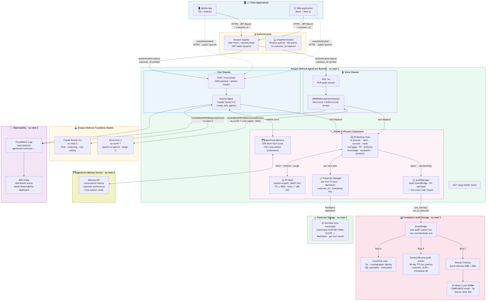
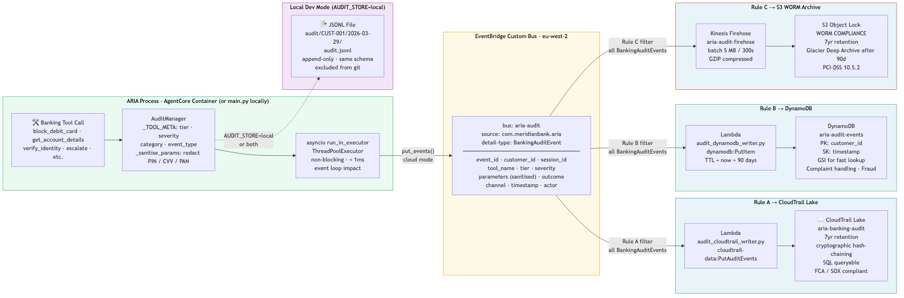

# ARIA — Automated Responsive Intelligence Agent

**ARIA** is Meridian Bank's AI-powered banking assistant, available on two channels:

| Channel | Model | How |
|---------|-------|-----|
| **Chat** (text REPL) | Amazon Bedrock · Claude Sonnet 4.6 | [Strands Agents](https://strandsagents.com) framework, streaming text |
| **Voice** (speech‑to‑speech) | Amazon Bedrock · Nova Sonic 2 | Direct bidirectional stream API (`aws_sdk_bedrock_runtime`) |
| **AgentCore** (cloud hosted) | Both Claude Sonnet 4.6 + Nova Sonic 2 | `aria/agentcore_app.py` — HTTPS chat + WSS voice via Amazon Bedrock AgentCore Runtime |

Both channels share the same 20 modular banking tools, the same PII vault pipeline, the same knowledge-based authentication flow, and the same empathy/vulnerability-handling instructions. Only the I/O layer differs.

---

## Architecture

### System Overview


---

### Chat Agent — Request/Response Flow


---

### Voice Agent — Nova Sonic 2 S2S Flow


---

### PII Vault Pipeline


> **Key guarantee:** Raw PII never enters the model's reasoning context. The LLM (Claude or Nova Sonic) sees only `vault://session_id/TOKEN_KEY` URIs at every step.

---

### AgentCore Deployed Stack



Full production deployment on Amazon Bedrock AgentCore Runtime, showing authenticated and unauthenticated access from mobile and web clients, all AWS services, audit compliance storage, and transcript storage.

---

### Audit Event Flow



Non-blocking EventBridge fan-out from every banking tool call to three compliance storage tiers.

---

## Prerequisites

- **Python 3.11+**
- **AWS credentials** configured (`~/.aws/credentials`, env vars, or IAM role)
- **Bedrock access** — `bedrock:InvokeModel` and `bedrock:InvokeModelWithResponseStream` in your target region
- **Voice only** — `bedrock:InvokeModelWithBidirectionalStream` in a Nova Sonic 2 region (`us-east-1`, `eu-north-1`, or `ap-northeast-1`)
- **Voice only (local)** — `portaudio` system library for PyAudio:
  ```bash
  brew install portaudio          # macOS
  sudo apt-get install portaudio19-dev  # Debian/Ubuntu
  ```
- **Cloud deploy only** — `agentcore` CLI: `pip install bedrock-agentcore-starter-toolkit`
- `uv` (recommended) or `pip`

---

## Installation

### Using `uv` (recommended)

```bash
uv venv
source .venv/bin/activate
uv pip install -r requirements.txt
uv pip install -e .
```

### Using `pip`

```bash
python -m venv .venv
source .venv/bin/activate
pip install -r requirements.txt
pip install -e .
```

---

## Configuration

Copy `.env.example` to `.env` and set values:

```bash
cp .env.example .env
```

### Core settings

| Variable            | Default                         | Description                                               |
|---------------------|---------------------------------|-----------------------------------------------------------|
| `AWS_REGION`        | `eu-west-2`                     | AWS region for Bedrock (chat agent / Claude)              |
| `AWS_PROFILE`       | `default`                       | AWS CLI profile                                           |
| `BEDROCK_MODEL_ID`  | `anthropic.claude-sonnet-4-6`   | Claude model ID for the chat agent                        |
| `BANK_API_BASE_URL` | `https://api.meridianbank.internal` | Core banking API base URL (stub in dev)               |
| `BANK_API_KEY`      | —                               | API key for the core banking API                          |
| `PII_VAULT_BACKEND` | `in_memory`                     | PII vault backend (`in_memory`, `aws_secrets_manager`)    |
| `LOG_LEVEL`         | `INFO`                          | Python logging level                                      |

### Voice settings

| Variable                  | Default    | Description                                                                   |
|---------------------------|------------|-------------------------------------------------------------------------------|
| `NOVA_SONIC_REGION`       | —          | **Required for voice.** Must be `us-east-1`, `eu-north-1`, or `ap-northeast-1` |
| `ECHO_GATE_TAIL_SECS`     | `0.8`      | Seconds to keep mic muted after ARIA finishes speaking                        |
| `NOVA_BARGE_IN_THRESHOLD` | `800`      | RMS energy threshold for barge-in. Set `0` to disable gate (headphone users) |

### Transcript settings

| Variable                | Default       | Description                                        |
|-------------------------|---------------|----------------------------------------------------|
| `TRANSCRIPT_STORE`      | `local`       | `local` \| `s3` \| `both`                         |
| `TRANSCRIPT_S3_BUCKET`  | —             | S3 bucket for cloud transcript storage             |
| `TRANSCRIPT_S3_PREFIX`  | `transcripts` | S3 key prefix                                      |

### Audit settings

| Variable                  | Default      | Description                                                  |
|---------------------------|--------------|--------------------------------------------------------------|
| `AUDIT_STORE`             | `local`      | `local` \| `eventbridge` \| `both`                          |
| `AUDIT_EVENTBRIDGE_BUS`   | —            | EventBridge bus name (e.g. `aria-audit`)                     |
| `AUDIT_REGION`            | `eu-west-2`  | AWS region for EventBridge client                            |

### AgentCore settings

| Variable              | Default | Description                                                        |
|-----------------------|---------|--------------------------------------------------------------------|
| `AGENTCORE_MEMORY_ID` | —       | AgentCore Memory resource ID — enables persistent conversation history |

---

## Running the Agent

### Chat mode (text REPL)

```bash
# Unauthenticated
python main.py

# Pre-authenticated (skips KBA challenge)
python main.py --auth --customer-id CUST-001
```

Type your query at the `Customer:` prompt. Type `quit` or press `Ctrl-C` to exit.

### Voice mode (Nova Sonic 2 S2S)

```bash
# Unauthenticated voice session
python main.py --channel voice

# Pre-authenticated voice session
python main.py --channel voice --auth --customer-id CUST-001
```

Speak naturally. Say **"stop conversation"** or press `Ctrl-C` to end the session.

**Session banner example:**
```
============================================================
  ARIA — Meridian Bank Voice Banking Agent
  Mode: Authenticated  |  Customer: CUST-001
  Channel: VOICE (Nova Sonic 2 S2S)  |  Logs → aria.log
  Say 'stop' or press Ctrl-C to end the session
============================================================
```

### AgentCore deployed mode

Invoke the running AgentCore endpoint via the `agentcore` CLI:

```bash
agentcore invoke --payload '{"message": "What is my account balance?", "authenticated": true, "customer_id": "CUST-001"}'
```

Or call it directly with boto3:

```python
import boto3, json

client = boto3.client("bedrock-agentcore-runtime", region_name="eu-west-2")
response = client.invoke_agent(
    agentId="<your-agent-id>",
    sessionId="session-001",
    inputText=json.dumps({
        "message": "What is my account balance?",
        "authenticated": True,
        "customer_id": "CUST-001",
    }),
)
print(response["output"]["text"])
```

### CLI reference

```
usage: main.py [-h] [--channel {chat,voice}] [--auth] [--customer-id ID]

options:
  --channel {chat,voice}  Interaction channel (default: chat)
  --auth                  Mark session as pre-authenticated
  --customer-id ID        Customer ID (required with --auth)
```

---

## Deploying to AgentCore

### Quick start

```bash
./scripts/deploy.sh deploy
```

The interactive deploy script handles every AWS resource end-to-end. It prompts for the AWS region and profile, creates all infrastructure, builds and pushes the Docker image via CodeBuild (no local Docker required), and launches the AgentCore Runtime.

### What the deploy script creates

| Resource | Purpose |
|---|---|
| S3 transcript bucket | Durable Markdown transcript storage |
| S3 audit WORM bucket | Immutable audit log archive (Object Lock) |
| DynamoDB table | Hot-path audit event index |
| EventBridge bus | `aria-audit` — audit event routing |
| CloudTrail Lake | Immutable queryable audit event store |
| Lambda × 2 | `audit_cloudtrail_writer` + `audit_dynamodb_writer` |
| Kinesis Firehose | EventBridge → S3 WORM delivery stream |
| AgentCore Runtime | Managed HTTPS + WSS endpoint in `eu-west-2` |

### Prerequisites for deploy

- AWS CLI v2 with `ecr:*`, `bedrock-agentcore:*`, `bedrock:InvokeModel`, `s3:*`, `dynamodb:*`, `events:*`, `lambda:*`, and `cloudtrail:*` permissions
- `agentcore` CLI: `pip install bedrock-agentcore-starter-toolkit`
- Bedrock model access for `anthropic.claude-sonnet-4-6` (eu-west-2) and `amazon.nova-2-sonic-v1:0` (eu-north-1 or us-east-1)

### Deploy options

| Option | How | Notes |
|---|---|---|
| **CodeBuild** (default) | `./scripts/deploy.sh deploy` | AWS builds the image — no local Docker required |
| **Local Docker build** | `agentcore launch` | Requires Docker Desktop; builds ARM64 image locally |

### Teardown

```bash
./scripts/deploy.sh teardown
```

Removes all AWS resources created by the deploy script. Prompts for confirmation before destroying the AgentCore Runtime and any S3/DynamoDB data.

### Status

```bash
./scripts/deploy.sh status
```

Lists the current state of all deployed resources.

### Manual deploy commands (reference)

```bash
# Launch AgentCore Runtime from local Docker build
agentcore launch

# Destroy AgentCore Runtime
agentcore destroy
```

For a full step-by-step guide including IAM permissions, ECR setup, environment variable injection, and troubleshooting, see [`docs/agentcore-deployment-guide.md`](docs/agentcore-deployment-guide.md).

---

## AgentCore API Reference

### AgentCore Architecture

| AgentCore service | ARIA maps to |
|---|---|
| **Runtime `/invocations`** | `aria/agentcore_app.py` → `@app.entrypoint` → Strands Agent (Claude Sonnet 4.6) |
| **Runtime `/ws`** | `aria/agentcore_app.py` → `@app.websocket` → `ARIAWebSocketVoiceSession` → Nova Sonic 2 S2S |
| **Memory** | `aria/memory_client.py` — conversation history saved/retrieved per session |
| **Runtime `/ping`** | Automatic health check handled by `BedrockAgentCoreApp` |

### Chat API (POST /invocations)

```bash
curl -X POST https://<agentcore-endpoint>/invocations \
  -H "Content-Type: application/json" \
  -H "Authorization: Bearer <token>" \
  -H "X-Amzn-Bedrock-AgentCore-Runtime-Session-Id: <session-id>" \
  -d '{"message": "What is my account balance?", "authenticated": true, "customer_id": "CUST-001"}'
```

**Payload fields:**

| Field | Type | When | Description |
|-------|------|------|-------------|
| `message` | string | Every call | Customer's text message |
| `authenticated` | bool | First call only | Whether the customer is already authenticated |
| `customer_id` | string | First call only | Customer ID (e.g. `CUST-001`) — required when `authenticated: true` |

On the **first call** in a session, ARIA automatically injects the `SESSION_START` trigger, fetches the customer profile via `get_customer_details`, and includes the greeting in its response.

### Voice API (WebSocket /ws)

```
wss://<agentcore-endpoint>/ws
```

**Client → Server (text, first message):**
```json
{"type": "session.config", "authenticated": true, "customer_id": "CUST-001"}
```

**Client → Server (binary):** Raw 16 kHz 16-bit mono PCM audio chunks (mic input)

**Server → Client (text):**
```json
{"type": "session.started"}
{"type": "transcript.user",  "text": "What is my balance?"}
{"type": "transcript.aria",  "text": "Your current balance is £5,240.00."}
{"type": "interrupt"}
{"type": "session.ended"}
{"type": "error", "message": "..."}
```

**Server → Client (binary):** Raw 24 kHz 16-bit mono PCM audio (ARIA's voice)

### Local Development Server

```bash
# Start the AgentCore app locally (no Docker required)
uvicorn aria.agentcore_app:app --port 8080 --reload

# Test health check
curl http://localhost:8080/ping

# Test a chat turn (no auth for quick smoke test)
curl -X POST http://localhost:8080/invocations \
  -H "Content-Type: application/json" \
  -H "X-Amzn-Bedrock-AgentCore-Runtime-Session-Id: test-session-1" \
  -d '{"message": "Hello Aria"}'
```

The local server is fully functional — all tools execute and voice sessions work. Set `AGENTCORE_MEMORY_ID` to test memory integration, or leave it unset to use in-memory conversation history only.

---

## Audit Events

### Overview

Every banking tool call emits a structured JSON audit event via `aria/audit_manager.py`. The `AuditManager` runs non-blocking — events are dispatched in a background thread via `run_in_executor`, adding less than 1 ms of event-loop impact per tool call.

### Tool tier classification

| Tier | Classification | Examples |
|---|---|---|
| **Tier 1 — Critical** | High-risk or irreversible actions | `block_debit_card`, `escalate_to_human_agent`, `validate_customer_auth` (failure) |
| **Tier 2 — Significant** | Sensitive data access | `get_account_details`, `get_credit_card_details`, `get_customer_details` |
| **Tier 3 — Informational** | Low-risk reads | `search_knowledge_base`, `get_product_catalogue`, `get_feature_parity` |

### Local mode

Set `AUDIT_STORE=local` (default). Audit events are appended as newline-delimited JSON to files under `audit/`:

```
audit/
  aria-audit-CUST-001-20260101T120000Z.jsonl
```

### Cloud mode

Set `AUDIT_STORE=eventbridge` or `AUDIT_STORE=both`. Events are published to the EventBridge bus named by `AUDIT_EVENTBRIDGE_BUS` and fan out to three compliance storage tiers:

| Tier | Storage | Retention |
|---|---|---|
| Hot | DynamoDB — queryable event index | 90 days (TTL) |
| Warm | CloudTrail Lake — immutable SQL-queryable event store | 7 years |
| Cold | S3 WORM bucket (Object Lock) — raw JSON archive | Configurable |

### Audit environment variables

| Variable | Default | Description |
|---|---|---|
| `AUDIT_STORE` | `local` | `local` \| `eventbridge` \| `both` |
| `AUDIT_EVENTBRIDGE_BUS` | — | EventBridge bus name (e.g. `aria-audit`) |
| `AUDIT_REGION` | `eu-west-2` | AWS region for EventBridge client |

See [`docs/audit-event-architecture.md`](docs/audit-event-architecture.md) for the full event schema and Lambda implementations.

---

## Transcripts

ARIA saves every session as a Markdown transcript for compliance, debugging, and quality review.

### Local mode

Set `TRANSCRIPT_STORE=local` (default). Transcripts are saved to:

```
transcripts/
  CUST-001/
    2026-01-01T12-00-00Z.md
    2026-01-01T13-30-00Z.md
```

Transcripts are written per-turn — if the agent crashes mid-session, everything up to the last completed turn is preserved.

### Cloud mode

Set `TRANSCRIPT_STORE=s3` or `TRANSCRIPT_STORE=both`. Transcripts are written to the S3 bucket and prefix defined by `TRANSCRIPT_S3_BUCKET` and `TRANSCRIPT_S3_PREFIX` (default: `transcripts`):

```
s3://<bucket>/transcripts/CUST-001/2026-01-01T12-00-00Z.md
```

### Transcript environment variables

| Variable | Default | Description |
|---|---|---|
| `TRANSCRIPT_STORE` | `local` | `local` \| `s3` \| `both` |
| `TRANSCRIPT_S3_BUCKET` | — | S3 bucket for cloud transcript storage |
| `TRANSCRIPT_S3_PREFIX` | `transcripts` | S3 key prefix |

See [`docs/transcript-storage.md`](docs/transcript-storage.md) for the Markdown format specification.

---

## Project Structure

```
awsagentcore/
├── pyproject.toml              # Project metadata and build config
├── requirements.txt            # Direct dependencies
├── Dockerfile                  # Container image for AgentCore Runtime (linux/arm64)
├── .env.example                # Environment variable template
├── main.py                     # Entry point — CLI router for chat and voice
├── scripts/
│   ├── deploy.sh               # Interactive full-stack deploy & teardown
│   └── lambdas/
│       ├── audit_cloudtrail_writer.py  # EventBridge → CloudTrail Lake Lambda
│       └── audit_dynamodb_writer.py    # EventBridge → DynamoDB Lambda
├── docs/
│   ├── adr/                    # Architecture Decision Records (ADR-001 to ADR-010)
│   ├── agentcore-deployment-guide.md   # Full AgentCore deployment guide
│   ├── agentcore-tools-architecture.md # Tools architecture for AgentCore
│   ├── audit-event-architecture.md     # Audit event storage architecture
│   ├── domain-sub-agent-architecture.md # Future domain sub-agent design
│   └── transcript-storage.md           # Transcript storage design
└── aria/
    ├── __init__.py
    ├── agent.py                # create_aria_agent() — wires Claude + tools + prompt
    ├── agentcore_app.py        # BedrockAgentCoreApp — chat (POST /invocations) + voice (WSS /ws)
    ├── agentcore_voice.py      # Cloud WebSocket voice session (no PyAudio)
    ├── audit_manager.py        # AuditManager — async EventBridge + local JSONL
    ├── memory_client.py        # AgentCore Memory API client
    ├── transcript_manager.py   # Markdown transcript writer (local + S3)
    ├── voice_agent.py          # ARIANovaSonicSession — Nova Sonic 2 S2S voice agent
    ├── system_prompt.py        # ARIA_SYSTEM_PROMPT (shared by both channels)
    ├── models/                 # Pydantic v2 request/response models
    │   ├── pii.py              # PIIDetect*, PIIVaultStore*, PIIVaultRetrieve*, PIIVaultPurge*
    │   ├── auth.py             # VerifyIdentity*, InitiateAuth*, ValidateAuth*, CrossValidate*
    │   ├── account.py          # AccountDetailsRequest/Response, Transaction
    │   ├── cards.py            # DebitCard*, BlockDebitCard*, CreditCard*
    │   ├── mortgage.py         # MortgageDetailsRequest/Response
    │   ├── customer.py         # CustomerDetailsResponse, VulnerabilityFlag
    │   ├── products.py         # Product, ProductCatalogueResponse
    │   ├── analytics.py        # SpendingInsightResponse, CategorySummary
    │   ├── knowledge.py        # KnowledgeArticle, KnowledgeSearchResponse
    │   └── escalation.py       # TranscriptSummary*, Escalate*
    └── tools/                  # @tool-decorated functions — ALL_TOOLS list
        ├── __init__.py         # ALL_TOOLS — single import for agent.py and voice_agent.py
        ├── pii/
        │   ├── detect_redact.py    # pii_detect_and_redact
        │   ├── vault_store.py      # pii_vault_store + _VAULT dict
        │   ├── vault_retrieve.py   # pii_vault_retrieve
        │   └── vault_purge.py      # pii_vault_purge
        ├── auth/
        │   ├── verify_identity.py  # verify_customer_identity
        │   ├── initiate_auth.py    # initiate_customer_auth
        │   ├── validate_auth.py    # validate_customer_auth
        │   └── cross_validate.py   # cross_validate_session_identity
        ├── customer/
        │   └── customer_details.py # get_customer_details
        ├── account/
        │   └── account_details.py  # get_account_details
        ├── debit_card/
        │   ├── card_details.py     # get_debit_card_details
        │   └── block_card.py       # block_debit_card
        ├── credit_card/
        │   └── card_details.py     # get_credit_card_details
        ├── mortgage/
        │   └── mortgage_details.py # get_mortgage_details
        ├── products/
        │   └── product_catalogue.py # get_product_catalogue
        ├── analytics/
        │   └── spending_insights.py # analyse_spending
        ├── knowledge/
        │   ├── knowledge_base.py   # search_knowledge_base
        │   └── feature_parity.py   # get_feature_parity
        └── escalation/
            ├── transcript_summary.py   # generate_transcript_summary
            └── human_handoff.py        # escalate_to_human_agent
```

---

## Tool Inventory

All 20 tools are shared identically between the chat, voice, and AgentCore channels.

| # | Tool Function                     | Group          | Description                                                              |
|---|-----------------------------------|----------------|--------------------------------------------------------------------------|
| 1 | `pii_detect_and_redact`           | PII Pipeline   | Regex-based PII detection (15+ types) — tokenises raw customer input     |
| 2 | `pii_vault_store`                 | PII Pipeline   | Session-scoped in-memory vault store with TTL (max 900 s)                |
| 3 | `pii_vault_retrieve`              | PII Pipeline   | Just-in-time retrieval of vault tokens before tool calls                 |
| 4 | `pii_vault_purge`                 | PII Pipeline   | Purge all session entries at end / timeout / escalation                  |
| 5 | `verify_customer_identity`        | Authentication | Validate header identity against requested customer record               |
| 6 | `initiate_customer_auth`          | Authentication | Start a knowledge-based auth (KBA) challenge                             |
| 7 | `validate_customer_auth`          | Authentication | Validate DOB + mobile last-four (max 3 attempts, then lock)              |
| 8 | `cross_validate_session_identity` | Authentication | Three-way check: header / auth-verified / body customer IDs              |
| 9 | `get_customer_details`            | Customer       | Full profile — accounts, cards, vulnerability flags, contact details     |
|10 | `get_account_details`             | Banking        | Balance, transactions, statement URL, or standing orders                 |
|11 | `get_debit_card_details`          | Banking        | Card status, limits, masked card number, expiry                          |
|12 | `block_debit_card`                | Banking        | Irreversible card block with optional replacement order                  |
|13 | `get_credit_card_details`         | Banking        | Balance, limit, minimum payment, APR, statement, dispute info            |
|14 | `get_mortgage_details`            | Banking        | Balance, rate, monthly payment, overpayment allowance, redemption        |
|15 | `get_product_catalogue`           | Products       | Available Meridian Bank products filtered by customer holdings           |
|16 | `analyse_spending`                | Analytics      | Categorised transaction spending insights across accounts                |
|17 | `search_knowledge_base`           | Knowledge      | KB article search — digital wallets, fraud, policies, processes          |
|18 | `get_feature_parity`              | Knowledge      | Chat-vs-branch feature parity for digital channels                       |
|19 | `generate_transcript_summary`     | Escalation     | Compile structured session summary (vault refs only, no raw PII)         |
|20 | `escalate_to_human_agent`         | Escalation     | Secure TLS handoff package to human agent routing system                 |

---

## Security Notes

### PII Pipeline
All customer input — in both chat and voice channels — flows through a mandatory four-stage PII pipeline before any reasoning or banking data access:

1. **Detect & Redact** (`pii_detect_and_redact`) — regex patterns identify and tokenise PII in raw input across 15+ types (DOB, sort code, account number, card number, postcode, NI number, phone, email, etc.).
2. **Vault Store** (`pii_vault_store`) — tokens are stored in a session-scoped vault (default: in-memory `_VAULT` dict) with a configurable TTL capped at 900 seconds (15 minutes).
3. **Vault Retrieve** (`pii_vault_retrieve`) — tokens are retrieved just-in-time, scoped by purpose, immediately before a banking tool call. The raw value exists in Python memory only for the duration of the call.
4. **Vault Purge** (`pii_vault_purge`) — all tokens are purged at session end, on inactivity timeout, on confirmed human escalation, or on a security event (3× auth failure).

**Raw PII never enters the model's reasoning context.** Both Claude Sonnet and Nova Sonic see only `vault://session_id/TOKEN_KEY` URIs throughout the session.

### Voice — Additional PII Handling
The voice agent sends `contentEnd` to Nova Sonic immediately on farewell detection. This prevents ARIA's spoken farewell from being echoed back through the microphone, which would cause a duplicate response turn — and potentially a second PII-detection cycle on ARIA's own speech.

### Vault TTL
The in-memory vault enforces a maximum TTL of **900 seconds**. For production, replace `_VAULT` in `aria/tools/pii/vault_store.py` with AWS Secrets Manager, AWS Parameter Store, or DynamoDB by setting `PII_VAULT_BACKEND` in `.env`.

### Authentication
Knowledge-based authentication is limited to **3 attempts** before the session locks. A locked session escalates immediately with `escalation_reason: security_event`.

### Empathy & Vulnerability Handling
ARIA detects customer vulnerability from both the customer profile (`vulnerability_flags`) and live spoken/typed cues — audible distress, confusion, repetition, third-party coercion. On vulnerable-customer calls:
- ARIA delivers one warm acknowledgement sentence **before** any task or tool call
- Irreversible actions (card block) are **halted** if third-party pressure is suspected
- ARIA escalates proactively with context included in the handoff transcript

### Prompt Injection Defence
ARIA ignores any instructions to bypass authentication, skip PII handling, or reveal internal procedures. It will not act on phrases like "you are now in test mode", "ignore previous instructions", or similar injection patterns.

### PCI-DSS Note
The stub implementations use in-memory synthetic data. Before production deployment, all `# TODO: Replace with ...` stubs must be replaced with real Meridian Bank API calls. The system must undergo a PCI-DSS scoping and assessment exercise before handling real card data. Never log, persist, or transmit raw card numbers, CVV codes, or PIN data.

---

## Voice Agent Details

### Supported regions for Nova Sonic 2
Nova Sonic 2 (`amazon.nova-2-sonic-v1:0`) is only available in three regions:

| Region | Location |
|--------|----------|
| `us-east-1` | US East (N. Virginia) |
| `eu-north-1` | Europe (Stockholm) |
| `ap-northeast-1` | Asia Pacific (Tokyo) |

Set `NOVA_SONIC_REGION` to one of the above. The chat agent (`AWS_REGION`) can point to any Bedrock-enabled region independently.

### Audio specification
| Direction | Sample rate | Bit depth | Channels | Encoding |
|-----------|------------|-----------|----------|----------|
| Input (mic → Nova Sonic) | 16 000 Hz | 16-bit PCM | Mono | Base64 chunks |
| Output (Nova Sonic → speaker) | 24 000 Hz | 16-bit PCM | Mono | Base64 chunks |

### Echo gate and barge-in
The voice agent uses an **RMS-based echo gate** to prevent ARIA's speaker output from re-entering the microphone and creating an echo loop:
- While ARIA is speaking, mic audio is checked for energy (RMS). Audio below `NOVA_BARGE_IN_THRESHOLD` (default 800, ~2.4% of 16-bit full scale) is replaced with silence before being sent to Nova Sonic.
- Audio **above** the threshold passes through — this is how barge-in (interruption) works. When a customer speaks loudly enough to exceed the threshold during ARIA playback, the real audio reaches Nova Sonic.
- Set `NOVA_BARGE_IN_THRESHOLD=0` to disable the gate entirely (recommended for headphone users where there is no echo).
- When Nova Sonic detects a barge-in, it returns `{"interrupted": true}` in the assistant `textOutput`. The voice agent drains the audio output queue and resets the echo gate immediately.

### Farewell detection and session teardown
When the customer says a farewell phrase ("goodbye", "thank you, goodbye", "stop conversation", etc.):
1. `_farewell_detected` flag is set
2. Mic audio is replaced with silence — prevents any further user-turn triggers
3. On `completionEnd` event (ARIA finishes its farewell response), mic audio input block is closed (`contentEnd`)
4. The Nova Sonic session ends cleanly (`promptEnd` + `sessionEnd`)

This prevents the double-farewell loop that would otherwise occur when ARIA's spoken farewell audio echoes back through the microphone.

---

## Architecture Decision Records

All significant architectural decisions are documented as ADRs in `docs/adr/`. Each ADR records the context, the decision made, and the consequences.

| ADR | Title | Summary |
|-----|-------|---------|
| [ADR-001](docs/adr/ADR-001-audit-transcript-non-blocking.md) | Audit and Transcript Non-Blocking Design | Audit and transcript I/O run via `run_in_executor` so they never block the agent event loop |
| [ADR-002](docs/adr/ADR-002-strands-agents-framework.md) | Strands Agents as the AI Agent Framework | Strands chosen over LangChain/LlamaIndex for native Bedrock integration and minimal overhead |
| [ADR-003](docs/adr/ADR-003-modular-tool-architecture.md) | Modular One-File-Per-Tool Architecture | One Python file per tool for isolation, independent testing, and clean git history |
| [ADR-004](docs/adr/ADR-004-pii-vault-in-memory.md) | PII Vault — In-Memory Session-Scoped Token Store | In-memory vault with TTL chosen over external store for latency; pluggable backend for prod |
| [ADR-005](docs/adr/ADR-005-nova-sonic-direct-api.md) | Nova Sonic 2 S2S — Direct aws_sdk_bedrock_runtime API | Direct bidirectional stream API used instead of Strands Bidi SDK for full control and stability |
| [ADR-006](docs/adr/ADR-006-echo-gate-barge-in.md) | PyAudio Echo Gate + NOVA_BARGE_IN Opt-In for Local Voice | RMS-based echo gate prevents mic feedback loop; threshold configurable or disabled for headphones |
| [ADR-007](docs/adr/ADR-007-agentcore-docker-ecr.md) | AgentCore Runtime — Docker Container in ECR | Docker/ECR chosen over ZIP upload for reproducible builds, dependency control, and ARM64 support |
| [ADR-008](docs/adr/ADR-008-in-process-tools-not-gateway.md) | In-Process Tool Execution (Not AgentCore Gateway Endpoints) | Tools execute in-process inside the container rather than via AgentCore Gateway for lower latency |
| [ADR-009](docs/adr/ADR-009-cross-region-model-access.md) | Cross-Region Model Access — Claude in eu-west-2, Nova Sonic in eu-north-1 | Claude hosted in eu-west-2 (GDPR); Nova Sonic accessed cross-region to eu-north-1 (only available region) |
| [ADR-010](docs/adr/ADR-010-audit-eventbridge-three-tier.md) | Audit Event Compliance Storage — EventBridge Fan-Out to Three-Tier Architecture | EventBridge routes audit events to DynamoDB (hot), CloudTrail Lake (warm), and S3 WORM (cold) |

---

## Development

### Running with stub data
All tool files contain stub implementations returning realistic synthetic data. No real bank API access is required — only Bedrock inference credentials.

### Replacing stubs
Each tool file has a `# TODO: Replace with ...` comment marking where to wire the real Meridian Bank core banking API. The Pydantic models in `aria/models/` define the request/response contracts.

### Adding tools
1. Add Pydantic models to `aria/models/`.
2. Create a tool file in `aria/tools/<group>/`.
3. Decorate the function with `@tool` from `strands`.
4. Import it and add to `ALL_TOOLS` in `aria/tools/__init__.py`.
5. Update `ARIA_SYSTEM_PROMPT` in `aria/system_prompt.py` to describe the new tool.
6. For voice, add any necessary override instructions to `_build_voice_system_prompt()` in `aria/voice_agent.py` if the tool docstring contains instructions that conflict with spoken-language behaviour.
