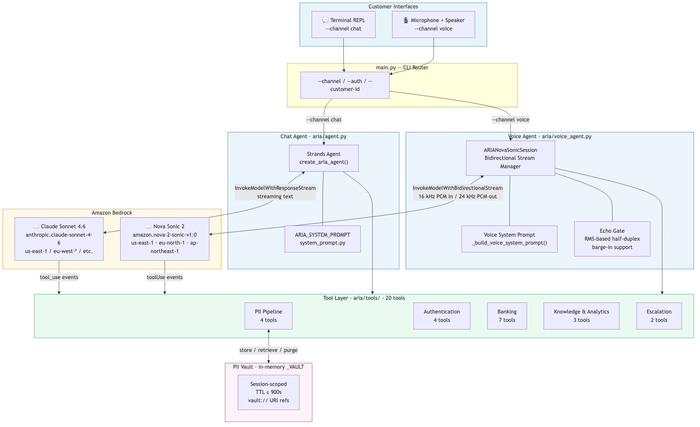
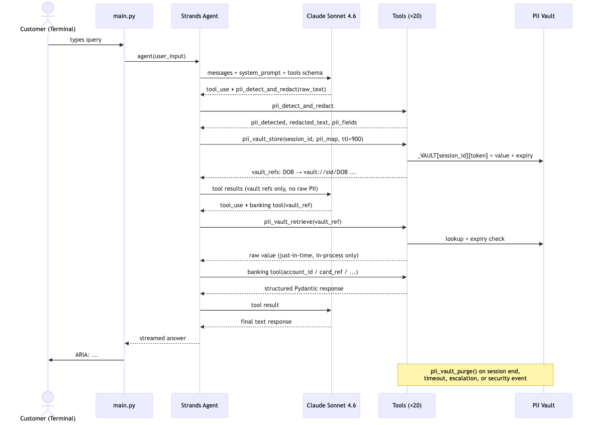
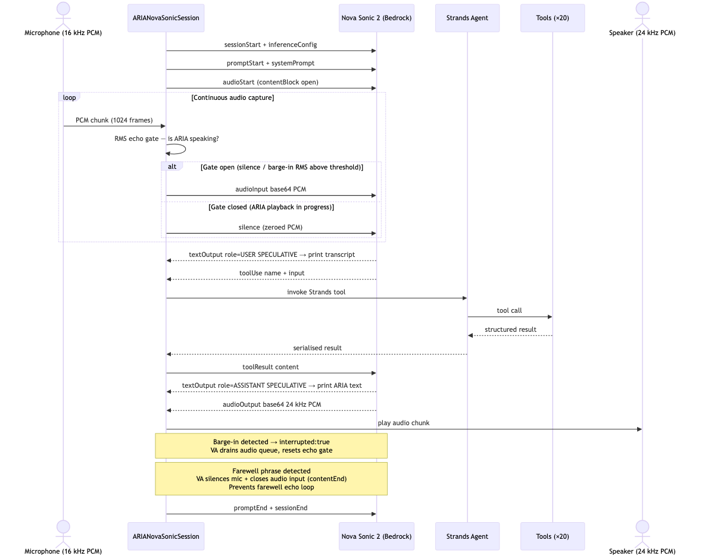
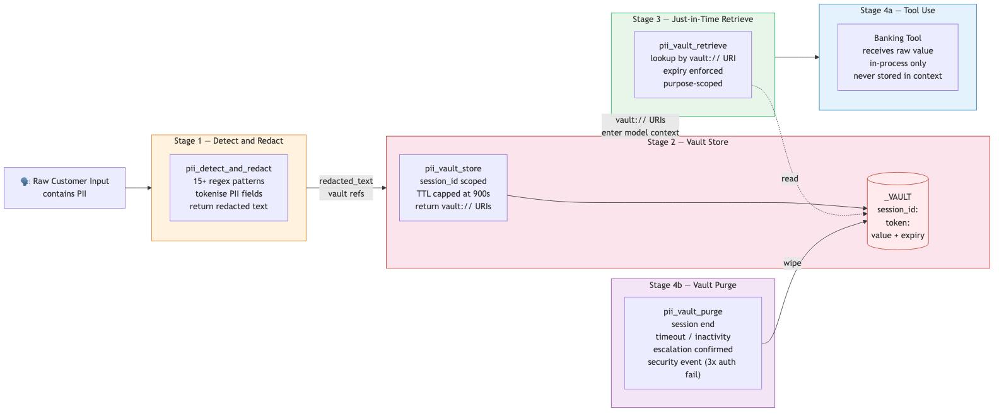

# ARIA — Automated Responsive Intelligence Agent

**ARIA** is Meridian Bank's AI-powered banking assistant, available on two channels:

| Channel | Model | How |
|---------|-------|-----|
| **Chat** (text REPL) | Amazon Bedrock · Claude Sonnet 4.6 | [Strands Agents](https://strandsagents.com) framework, streaming text |
| **Voice** (speech‑to‑speech) | Amazon Bedrock · Nova Sonic 2 | Direct bidirectional stream API (`aws_sdk_bedrock_runtime`) |

Both channels share the same 20 modular banking tools, the same PII vault pipeline, the same knowledge-based authentication flow, and the same empathy/vulnerability-handling instructions. Only the I/O layer differs.

---

## Architecture

### System Overview



---

### Chat Agent — Request/Response Flow



---

### Voice Agent — Nova Sonic 2 S2S Flow



---

### PII Vault Pipeline



> **Key guarantee:** Raw PII never enters the model's reasoning context. The LLM (Claude or Nova Sonic) sees only `vault://session_id/TOKEN_KEY` URIs at every step.

---

## Prerequisites

- **Python 3.11+**
- **AWS credentials** configured (`~/.aws/credentials`, env vars, or IAM role)
- **Bedrock access** — `bedrock:InvokeModel` and `bedrock:InvokeModelWithResponseStream` in your target region
- **Voice only** — `bedrock:InvokeModelWithBidirectionalStream` in a Nova Sonic 2 region (`us-east-1`, `eu-north-1`, or `ap-northeast-1`)
- **Voice only** — `portaudio` system library for PyAudio:
  ```bash
  brew install portaudio          # macOS
  sudo apt-get install portaudio19-dev  # Debian/Ubuntu
  ```
- `uv` (recommended) or `pip`

---

## Installation

### Using `uv` (recommended)

```bash
uv venv
source .venv/bin/activate
uv pip install -r requirements.txt
uv pip install -e .
```

### Using `pip`

```bash
python -m venv .venv
source .venv/bin/activate
pip install -r requirements.txt
pip install -e .
```

---

## Configuration

Copy `.env.example` to `.env` and set values:

```bash
cp .env.example .env
```

### Core settings

| Variable            | Default                         | Description                                               |
|---------------------|---------------------------------|-----------------------------------------------------------|
| `AWS_REGION`        | `eu-west-2`                     | AWS region for Bedrock (chat agent / Claude)              |
| `AWS_PROFILE`       | `default`                       | AWS CLI profile                                           |
| `BEDROCK_MODEL_ID`  | `anthropic.claude-sonnet-4-6`   | Claude model ID for the chat agent                        |
| `BANK_API_BASE_URL` | `https://api.meridianbank.internal` | Core banking API base URL (stub in dev)               |
| `BANK_API_KEY`      | —                               | API key for the core banking API                          |
| `PII_VAULT_BACKEND` | `in_memory`                     | PII vault backend (`in_memory`, `aws_secrets_manager`)    |
| `LOG_LEVEL`         | `INFO`                          | Python logging level                                      |

### Voice-only settings

| Variable                  | Default    | Description                                                                   |
|---------------------------|------------|-------------------------------------------------------------------------------|
| `NOVA_SONIC_REGION`       | —          | **Required for voice.** Must be `us-east-1`, `eu-north-1`, or `ap-northeast-1` |
| `ECHO_GATE_TAIL_SECS`     | `0.8`      | Seconds to keep mic muted after ARIA finishes speaking                        |
| `NOVA_BARGE_IN_THRESHOLD` | `800`      | RMS energy threshold for barge-in. Set `0` to disable gate (headphone users) |

---

## Running the Agent

### Chat mode (text REPL)

```bash
# Unauthenticated
python main.py

# Pre-authenticated (skips KBA challenge)
python main.py --auth --customer-id CUST-001
```

Type your query at the `Customer:` prompt. Type `quit` or press `Ctrl-C` to exit.

### Voice mode (Nova Sonic 2 S2S)

```bash
# Unauthenticated voice session
python main.py --channel voice

# Pre-authenticated voice session
python main.py --channel voice --auth --customer-id CUST-001
```

Speak naturally. Say **"stop conversation"** or press `Ctrl-C` to end the session.

**Session banner example:**
```
============================================================
  ARIA — Meridian Bank Voice Banking Agent
  Mode: Authenticated  |  Customer: CUST-001
  Channel: VOICE (Nova Sonic 2 S2S)  |  Logs → aria.log
  Say 'stop' or press Ctrl-C to end the session
============================================================
```

### CLI reference

```
usage: main.py [-h] [--channel {chat,voice}] [--auth] [--customer-id ID]

options:
  --channel {chat,voice}  Interaction channel (default: chat)
  --auth                  Mark session as pre-authenticated
  --customer-id ID        Customer ID (required with --auth)
```

---

## Project Structure

```
awsagentcore/
├── pyproject.toml              # Project metadata and build config
├── requirements.txt            # Direct dependencies
├── .env.example                # Environment variable template
├── main.py                     # Entry point — CLI router for chat and voice
└── aria/
    ├── __init__.py
    ├── agent.py                # create_aria_agent() — wires Claude + tools + prompt
    ├── voice_agent.py          # ARIANovaSonicSession — Nova Sonic 2 S2S voice agent
    ├── system_prompt.py        # ARIA_SYSTEM_PROMPT (shared by both channels)
    ├── models/                 # Pydantic v2 request/response models
    │   ├── pii.py              # PIIDetect*, PIIVaultStore*, PIIVaultRetrieve*, PIIVaultPurge*
    │   ├── auth.py             # VerifyIdentity*, InitiateAuth*, ValidateAuth*, CrossValidate*
    │   ├── account.py          # AccountDetailsRequest/Response, Transaction
    │   ├── cards.py            # DebitCard*, BlockDebitCard*, CreditCard*
    │   ├── mortgage.py         # MortgageDetailsRequest/Response
    │   ├── customer.py         # CustomerDetailsResponse, VulnerabilityFlag
    │   ├── products.py         # Product, ProductCatalogueResponse
    │   ├── analytics.py        # SpendingInsightResponse, CategorySummary
    │   ├── knowledge.py        # KnowledgeArticle, KnowledgeSearchResponse
    │   └── escalation.py       # TranscriptSummary*, Escalate*
    └── tools/                  # @tool-decorated functions — ALL_TOOLS list
        ├── __init__.py         # ALL_TOOLS — single import for agent.py and voice_agent.py
        ├── pii/
        │   ├── detect_redact.py    # pii_detect_and_redact
        │   ├── vault_store.py      # pii_vault_store + _VAULT dict
        │   ├── vault_retrieve.py   # pii_vault_retrieve
        │   └── vault_purge.py      # pii_vault_purge
        ├── auth/
        │   ├── verify_identity.py  # verify_customer_identity
        │   ├── initiate_auth.py    # initiate_customer_auth
        │   ├── validate_auth.py    # validate_customer_auth
        │   └── cross_validate.py   # cross_validate_session_identity
        ├── customer/
        │   └── customer_details.py # get_customer_details
        ├── account/
        │   └── account_details.py  # get_account_details
        ├── debit_card/
        │   ├── card_details.py     # get_debit_card_details
        │   └── block_card.py       # block_debit_card
        ├── credit_card/
        │   └── card_details.py     # get_credit_card_details
        ├── mortgage/
        │   └── mortgage_details.py # get_mortgage_details
        ├── products/
        │   └── product_catalogue.py # get_product_catalogue
        ├── analytics/
        │   └── spending_insights.py # analyse_spending
        ├── knowledge/
        │   ├── knowledge_base.py   # search_knowledge_base
        │   └── feature_parity.py   # get_feature_parity
        └── escalation/
            ├── transcript_summary.py   # generate_transcript_summary
            └── human_handoff.py        # escalate_to_human_agent
```

---

## Tool Inventory

All 20 tools are shared identically between the chat and voice channels.

| # | Tool Function                     | Group          | Description                                                              |
|---|-----------------------------------|----------------|--------------------------------------------------------------------------|
| 1 | `pii_detect_and_redact`           | PII Pipeline   | Regex-based PII detection (15+ types) — tokenises raw customer input     |
| 2 | `pii_vault_store`                 | PII Pipeline   | Session-scoped in-memory vault store with TTL (max 900 s)                |
| 3 | `pii_vault_retrieve`              | PII Pipeline   | Just-in-time retrieval of vault tokens before tool calls                 |
| 4 | `pii_vault_purge`                 | PII Pipeline   | Purge all session entries at end / timeout / escalation                  |
| 5 | `verify_customer_identity`        | Authentication | Validate header identity against requested customer record               |
| 6 | `initiate_customer_auth`          | Authentication | Start a knowledge-based auth (KBA) challenge                             |
| 7 | `validate_customer_auth`          | Authentication | Validate DOB + mobile last-four (max 3 attempts, then lock)              |
| 8 | `cross_validate_session_identity` | Authentication | Three-way check: header / auth-verified / body customer IDs              |
| 9 | `get_customer_details`            | Customer       | Full profile — accounts, cards, vulnerability flags, contact details     |
|10 | `get_account_details`             | Banking        | Balance, transactions, statement URL, or standing orders                 |
|11 | `get_debit_card_details`          | Banking        | Card status, limits, masked card number, expiry                          |
|12 | `block_debit_card`                | Banking        | Irreversible card block with optional replacement order                  |
|13 | `get_credit_card_details`         | Banking        | Balance, limit, minimum payment, APR, statement, dispute info            |
|14 | `get_mortgage_details`            | Banking        | Balance, rate, monthly payment, overpayment allowance, redemption        |
|15 | `get_product_catalogue`           | Products       | Available Meridian Bank products filtered by customer holdings           |
|16 | `analyse_spending`                | Analytics      | Categorised transaction spending insights across accounts                |
|17 | `search_knowledge_base`           | Knowledge      | KB article search — digital wallets, fraud, policies, processes          |
|18 | `get_feature_parity`              | Knowledge      | Chat-vs-branch feature parity for digital channels                       |
|19 | `generate_transcript_summary`     | Escalation     | Compile structured session summary (vault refs only, no raw PII)         |
|20 | `escalate_to_human_agent`         | Escalation     | Secure TLS handoff package to human agent routing system                 |

---

## Security Notes

### PII Pipeline
All customer input — in both chat and voice channels — flows through a mandatory four-stage PII pipeline before any reasoning or banking data access:

1. **Detect & Redact** (`pii_detect_and_redact`) — regex patterns identify and tokenise PII in raw input across 15+ types (DOB, sort code, account number, card number, postcode, NI number, phone, email, etc.).
2. **Vault Store** (`pii_vault_store`) — tokens are stored in a session-scoped vault (default: in-memory `_VAULT` dict) with a configurable TTL capped at 900 seconds (15 minutes).
3. **Vault Retrieve** (`pii_vault_retrieve`) — tokens are retrieved just-in-time, scoped by purpose, immediately before a banking tool call. The raw value exists in Python memory only for the duration of the call.
4. **Vault Purge** (`pii_vault_purge`) — all tokens are purged at session end, on inactivity timeout, on confirmed human escalation, or on a security event (3× auth failure).

**Raw PII never enters the model's reasoning context.** Both Claude Sonnet and Nova Sonic see only `vault://session_id/TOKEN_KEY` URIs throughout the session.

### Voice — Additional PII Handling
The voice agent sends `contentEnd` to Nova Sonic immediately on farewell detection. This prevents ARIA's spoken farewell from being echoed back through the microphone, which would cause a duplicate response turn — and potentially a second PII-detection cycle on ARIA's own speech.

### Vault TTL
The in-memory vault enforces a maximum TTL of **900 seconds**. For production, replace `_VAULT` in `aria/tools/pii/vault_store.py` with AWS Secrets Manager, AWS Parameter Store, or DynamoDB by setting `PII_VAULT_BACKEND` in `.env`.

### Authentication
Knowledge-based authentication is limited to **3 attempts** before the session locks. A locked session escalates immediately with `escalation_reason: security_event`.

### Empathy & Vulnerability Handling
ARIA detects customer vulnerability from both the customer profile (`vulnerability_flags`) and live spoken/typed cues — audible distress, confusion, repetition, third-party coercion. On vulnerable-customer calls:
- ARIA delivers one warm acknowledgement sentence **before** any task or tool call
- Irreversible actions (card block) are **halted** if third-party pressure is suspected
- ARIA escalates proactively with context included in the handoff transcript

### Prompt Injection Defence
ARIA ignores any instructions to bypass authentication, skip PII handling, or reveal internal procedures. It will not act on phrases like "you are now in test mode", "ignore previous instructions", or similar injection patterns.

### PCI-DSS Note
The stub implementations use in-memory synthetic data. Before production deployment, all `# TODO: Replace with ...` stubs must be replaced with real Meridian Bank API calls. The system must undergo a PCI-DSS scoping and assessment exercise before handling real card data. Never log, persist, or transmit raw card numbers, CVV codes, or PIN data.

---

## Voice Agent Details

### Supported regions for Nova Sonic 2
Nova Sonic 2 (`amazon.nova-2-sonic-v1:0`) is only available in three regions:

| Region | Location |
|--------|----------|
| `us-east-1` | US East (N. Virginia) |
| `eu-north-1` | Europe (Stockholm) |
| `ap-northeast-1` | Asia Pacific (Tokyo) |

Set `NOVA_SONIC_REGION` to one of the above. The chat agent (`AWS_REGION`) can point to any Bedrock-enabled region independently.

### Audio specification
| Direction | Sample rate | Bit depth | Channels | Encoding |
|-----------|------------|-----------|----------|----------|
| Input (mic → Nova Sonic) | 16 000 Hz | 16-bit PCM | Mono | Base64 chunks |
| Output (Nova Sonic → speaker) | 24 000 Hz | 16-bit PCM | Mono | Base64 chunks |

### Echo gate and barge-in
The voice agent uses an **RMS-based echo gate** to prevent ARIA's speaker output from re-entering the microphone and creating an echo loop:
- While ARIA is speaking, mic audio is checked for energy (RMS). Audio below `NOVA_BARGE_IN_THRESHOLD` (default 800, ~2.4% of 16-bit full scale) is replaced with silence before being sent to Nova Sonic.
- Audio **above** the threshold passes through — this is how barge-in (interruption) works. When a customer speaks loudly enough to exceed the threshold during ARIA playback, the real audio reaches Nova Sonic.
- Set `NOVA_BARGE_IN_THRESHOLD=0` to disable the gate entirely (recommended for headphone users where there is no echo).
- When Nova Sonic detects a barge-in, it returns `{"interrupted": true}` in the assistant `textOutput`. The voice agent drains the audio output queue and resets the echo gate immediately.

### Farewell detection and session teardown
When the customer says a farewell phrase ("goodbye", "thank you, goodbye", "stop conversation", etc.):
1. `_farewell_detected` flag is set
2. Mic audio is replaced with silence — prevents any further user-turn triggers
3. On `completionEnd` event (ARIA finishes its farewell response), mic audio input block is closed (`contentEnd`)
4. The Nova Sonic session ends cleanly (`promptEnd` + `sessionEnd`)

This prevents the double-farewell loop that would otherwise occur when ARIA's spoken farewell audio echoes back through the microphone.

---

## Amazon Bedrock AgentCore Hosting

ARIA can run in two modes:

| Mode | How to start | When to use |
|------|-------------|-------------|
| **Local** | `python3 main.py` | Development & testing on your machine |
| **AgentCore** | `agentcore deploy --local-build` | Production — Docker → ECR → managed runtime |

Both modes use the same banking tools and system prompt. The AgentCore runtime adds managed session isolation, memory, and a secure HTTPS/WebSocket endpoint accessible from mobile apps and websites.

---

### AgentCore Architecture

| AgentCore service | ARIA maps to |
|---|---|
| **Runtime `/invocations`** | `aria/agentcore_app.py` → `@app.entrypoint` → Strands Agent (Claude Sonnet 4.6) |
| **Runtime `/ws`** | `aria/agentcore_app.py` → `@app.websocket` → `ARIAWebSocketVoiceSession` → Nova Sonic 2 S2S |
| **Memory** | `aria/memory_client.py` — conversation history saved/retrieved per session |
| **Runtime `/ping`** | Automatic health check handled by `BedrockAgentCoreApp` |

---

### Prerequisites

- Docker Desktop (for local builds)
- AWS CLI v2 with credentials that have `ecr:*`, `bedrock-agentcore:*`, and `bedrock:InvokeModel` permissions
- `bedrock-agentcore-starter-toolkit` CLI: `pip install bedrock-agentcore-starter-toolkit`

---

### Deploy with Docker → ECR (recommended)

```bash
# 1. Configure the deployment (already present in .bedrock_agentcore.yaml)
cat .bedrock_agentcore.yaml

# 2. Build the Docker image locally and push to Amazon ECR
#    --local-build builds on your machine (ARM64) and pushes to ECR
agentcore deploy --local-build

# 3. (Optional) Test the image locally before deploying
agentcore deploy --local
```

The `agentcore deploy --local-build` command:
1. Builds `Dockerfile` for `linux/arm64` (required by AgentCore Runtime)
2. Creates an ECR repository if it does not exist
3. Pushes the image to ECR
4. Deploys the AgentCore Runtime endpoint

---

### Environment Variables (AgentCore)

All variables from the local `.env` file are needed in the cloud too. Set them as AgentCore Runtime environment variables or via AWS Secrets Manager:

| Variable | Required | Description |
|----------|----------|-------------|
| `AWS_REGION` | Yes | Bedrock region for Claude (e.g. `eu-west-2`) |
| `NOVA_SONIC_REGION` | Yes (voice) | Nova Sonic 2 region (`us-east-1`, `eu-north-1`, `ap-northeast-1`) |
| `AGENTCORE_MEMORY_ID` | Optional | AgentCore Memory resource ID — enables conversation history |
| `BEDROCK_MODEL_ID` | Optional | Override the Claude model ID |
| `LOG_LEVEL` | Optional | `DEBUG` / `INFO` / `WARNING` (default: `INFO`) |

When `AGENTCORE_MEMORY_ID` is not set the memory client becomes a no-op and the agent works without memory — useful for testing.

---

### Chat API (POST /invocations)

```bash
curl -X POST https://<agentcore-endpoint>/invocations \
  -H "Content-Type: application/json" \
  -H "Authorization: Bearer <token>" \
  -H "X-Amzn-Bedrock-AgentCore-Runtime-Session-Id: <session-id>" \
  -d '{"message": "What is my account balance?", "authenticated": true, "customer_id": "CUST-001"}'
```

**Payload fields:**

| Field | Type | When | Description |
|-------|------|------|-------------|
| `message` | string | Every call | Customer's text message |
| `authenticated` | bool | First call only | Whether the customer is already authenticated |
| `customer_id` | string | First call only | Customer ID (e.g. `CUST-001`) — required when `authenticated: true` |

On the **first call** in a session, ARIA automatically injects the `SESSION_START` trigger, fetches the customer profile via `get_customer_details`, and includes the greeting in its response.

---

### Voice API (WebSocket /ws)

```
wss://<agentcore-endpoint>/ws
```

**Client → Server (text, first message):**
```json
{"type": "session.config", "authenticated": true, "customer_id": "CUST-001"}
```

**Client → Server (binary):** Raw 16 kHz 16-bit mono PCM audio chunks (mic input)

**Server → Client (text):**
```json
{"type": "session.started"}
{"type": "transcript.user",  "text": "What is my balance?"}
{"type": "transcript.aria",  "text": "Your current balance is £5,240.00."}
{"type": "interrupt"}
{"type": "session.ended"}
{"type": "error", "message": "..."}
```

**Server → Client (binary):** Raw 24 kHz 16-bit mono PCM audio (ARIA's voice)

---

### Local Development Server

```bash
# Start the AgentCore app locally (no Docker required)
uvicorn aria.agentcore_app:app --port 8080 --reload

# Test health check
curl http://localhost:8080/ping

# Test a chat turn (no auth for quick smoke test)
curl -X POST http://localhost:8080/invocations \
  -H "Content-Type: application/json" \
  -H "X-Amzn-Bedrock-AgentCore-Runtime-Session-Id: test-session-1" \
  -d '{"message": "Hello Aria"}'
```

The local server is fully functional — all tools execute and voice sessions work. Set `AGENTCORE_MEMORY_ID` to test memory integration, or leave it unset to use in-memory conversation history only.

---

## Development

### Running with stub data
All tool files contain stub implementations returning realistic synthetic data. No real bank API access is required — only Bedrock inference credentials.

### Replacing stubs
Each tool file has a `# TODO: Replace with ...` comment marking where to wire the real Meridian Bank core banking API. The Pydantic models in `aria/models/` define the request/response contracts.

### Adding tools
1. Add Pydantic models to `aria/models/`.
2. Create a tool file in `aria/tools/<group>/`.
3. Decorate the function with `@tool` from `strands`.
4. Import it and add to `ALL_TOOLS` in `aria/tools/__init__.py`.
5. Update `ARIA_SYSTEM_PROMPT` in `aria/system_prompt.py` to describe the new tool.
6. For voice, add any necessary override instructions to `_build_voice_system_prompt()` in `aria/voice_agent.py` if the tool docstring contains instructions that conflict with spoken-language behaviour.
