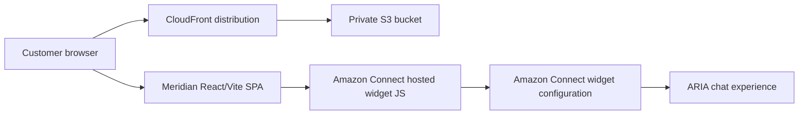

# Meridian Chat Widget Playbook

| Field | Value |
|---|---|
| **Document ID** | PLY-MCW-001 |
| **Version** | 1.0 |
| **Owner** | Platform Engineering |
| **Date** | 2026-05-25 |
| **Status** | Active |
| **Classification** | Internal |

---

## 1. Purpose and Scope

This playbook defines the controlled deployment and operational release approach for the **Meridian chat widget** in the `awsagentcore` repository. The component lives in `connect-chat-widget/` and is a **React + Vite single-page application** that renders a Meridian Bank landing page and loads the **Amazon Connect hosted chat widget** from Amazon Connect's CDN.

In production, the widget is a **customer-facing web component** delivered through **CloudFront** with a **private S3 origin**. The React shell presents Meridian branding and the embedded Connect widget opens the chat experience customers use to reach **ARIA**.

### In scope

- `connect-chat-widget/` React/Vite frontend
- Hosted Amazon Connect chat widget bootstrap in `connect-chat-widget/index.html`
- Meridian-specific branding, colours, and participant display names
- `scripts/deploy_connect_widget.sh` deployment to S3 + CloudFront
- Static asset delivery, cache control, invalidation, and approved-origin checks

### Out of scope

- Amazon Connect instance creation or channel enablement
- Contact-flow authoring inside the Amazon Connect console
- Lambda/API implementation behind the ARIA experience
- DNS, ACM custom certificates, or WAF configuration not present in the script
- Changes to the upstream Amazon Connect hosted widget service

---

## 2. Component Overview

### 2.1 Architecture summary

The Meridian widget is a thin React host page around the Amazon Connect hosted chat widget:

1. `src/main.jsx` mounts the React app.
2. `src/App.jsx` renders the Meridian landing page shell.
3. `index.html` loads `https://conversationalbot.my.connect.aws/connectwidget/static/amazon-connect-chat-interface-client.js` and configures `amazon_connect(...)`.
4. `src/components/ConnectChatWidget.jsx` uses a `MutationObserver` to relabel Connect transcript participants from `BOT` to `ARIA` and from `SYSTEM` to `Meridian Bank`.
5. `scripts/deploy_connect_widget.sh` builds the app, uploads `dist/` to S3, creates or reuses CloudFront resources, and invalidates cache.

### 2.2 Delivery topology



### 2.3 Source-based configuration currently present

| Area | Source | Current implementation |
|---|---|---|
| App shell | `connect-chat-widget/src/App.jsx` | Meridian landing page with hero, feature cards, and footer |
| Local dev port | `connect-chat-widget/vite.config.js` | `4000` for `vite` dev server and preview |
| Public assets | `connect-chat-widget/public/` | `favicon.svg` |
| Widget script URL | `connect-chat-widget/index.html` | `https://conversationalbot.my.connect.aws/connectwidget/static/amazon-connect-chat-interface-client.js` |
| Widget bootstrap API | `connect-chat-widget/index.html` | `amazon_connect('styles'|'customDisplayNames'|'snippetId'|'supportedMessagingContentTypes'|'contactAttributes', ...)` |
| Participant relabeling | `connect-chat-widget/src/components/ConnectChatWidget.jsx` | `BOT -> ARIA`, `SYSTEM -> Meridian Bank` |
| Brand colours | `connect-chat-widget/src/index.css`, `index.html` | `#123456`, `#1a4a7a`, accent `#0ea5e9` |

### 2.4 Important limitation from source review

The current repository **does not expose** the following as discrete build-time variables or files:

- Amazon Connect instance URL
- Contact flow ARN / ID
- AWS region for chat initiation
- API Gateway endpoint
- Explicit `StartChatContact` client code

Instead, the widget is configured through a **hosted Amazon Connect snippet ID** in `connect-chat-widget/index.html`. Any mapping from the snippet to Connect instance, flow, or downstream ARIA integration is controlled outside this React codebase, in Amazon Connect.

---

## 3. Prerequisites

| Requirement | Detail |
|---|---|
| Node.js | **Node.js 20+ operationally recommended** for build/deploy work; `package.json` does not declare an `engines` field |
| npm | Required for `npm install` and `npm run build` |
| AWS CLI v2 | Required by `scripts/deploy_connect_widget.sh` |
| AWS credentials | Must allow S3, CloudFront, and STS operations used by the script |
| Amazon Connect widget configuration | A valid hosted widget snippet configured in Amazon Connect |
| Approved origins | Must include `http://localhost:4000` for dev and the final CloudFront URL for production |
| S3 bucket name availability | Default name is `meridian-connect-widget-<env>` unless `--bucket-name` is supplied |
| CloudFront permissions | Required for OAC, response headers policy, distribution create/update, and invalidation |

**Operational note:** if the service team manages ARIA routing through Amazon Connect contact flows and Lambda integrations, validate that configuration in the Connect console before release; it is not stored in this widget source tree.

---

## 4. Deployment Strategy

### 4.1 Deployment phases implemented by `deploy_connect_widget.sh`

| Phase | Implementation from script | Outcome |
|---|---|---|
| 1. Install + build | `npm install --silent` then `npm run build` | Produces `connect-chat-widget/dist/` |
| 2. Private S3 bucket | `aws s3api create-bucket`, block public access, AES-256 encryption, versioning suspended, delete bucket CORS | Private origin bucket prepared |
| 3. CloudFront OAC | `aws cloudfront create-origin-access-control` | CloudFront gets signed S3 access |
| 4. Initial bucket policy | `aws s3api put-bucket-policy` with wildcard distribution ARN | Allows CloudFront read access during distribution creation |
| 5. Response headers policy | `aws cloudfront create-response-headers-policy` | Applies HSTS, `SAMEORIGIN`, `nosniff`, referrer policy, XSS protection |
| 6. Distribution create/reuse | `aws cloudfront create-distribution` or stored ID reuse | HTTPS CDN endpoint with SPA fallback |
| 7. Tighten bucket policy | `aws s3api put-bucket-policy` with exact distribution ARN | Restricts S3 reads to the created distribution |
| 8. Upload build output | `aws s3 sync` and `aws s3 cp` with differentiated cache headers | `index.html`, hashed assets, and other files published |
| 9. Cache invalidation | `aws cloudfront create-invalidation --paths "/*"` | Forces refresh of edge cache |

### 4.2 Security and caching behaviour from the script

- **S3 is private**; browser traffic goes through CloudFront only.
- **Origin Access Control (OAC)** is used instead of a public bucket.
- **HTTPS-only** viewer policy with minimum TLS `TLSv1.2_2021`.
- **No CSP header** is added by the script because the Connect widget needs external CDN access.
- Cache policy is split as follows:
  - `/index.html` -> no-cache
  - `/assets/*` -> 1 year immutable
  - everything else -> 1 day
- `403` and `404` responses are rewritten to `/index.html` for SPA routing.

### 4.3 Release sequencing

Promote in order:

1. Local development (`vite` on port `4000`)
2. Non-production deployment (`--env staging` or equivalent)
3. Production deployment (`--env prod` default)

No production release should be declared complete until the CloudFront URL is live and the Amazon Connect approved-origin entry has been added.

---

## 5. Environment Matrix

### 5.1 Runtime environments

| Environment | Command / deployment mode | Port / endpoint | Notes |
|---|---|---|---|
| Local development | `cd connect-chat-widget && npm run dev` | `http://localhost:4000` | Port is set in `vite.config.js`; add localhost origin in Amazon Connect |
| Staging | `bash scripts/deploy_connect_widget.sh --env staging` | `https://<staging-cloudfront-domain>` | Creates or reuses staging-tagged bucket/state file names |
| Production | `bash scripts/deploy_connect_widget.sh` | `https://<production-cloudfront-domain>` | Default `ENV=prod`, default region `eu-west-2` |

### 5.2 Configuration source of truth

The current widget **does not read any `VITE_*` environment variables**. Configuration is hardcoded in:

- `connect-chat-widget/index.html` for snippet/style/contact attributes
- `connect-chat-widget/src/components/ConnectChatWidget.jsx` for participant relabeling
- `connect-chat-widget/vite.config.js` for local dev/preview port

### 5.3 Placeholder matrix for values not stored in source

Use placeholders in release records for configuration managed outside the repo:

| Placeholder | Present in source? | Notes |
|---|---|---|
| `VITE_CONNECT_INSTANCE_URL=<YOUR_CONNECT_INSTANCE_URL>` | No | Not consumed by current code; underlying Connect instance is abstracted behind the hosted snippet |
| `VITE_CONTACT_FLOW_ID=<YOUR_CONTACT_FLOW_ID>` | No | Not consumed by current code |
| `VITE_AWS_REGION=<YOUR_AWS_REGION>` | No | Deploy script defaults AWS infrastructure to `eu-west-2`, but widget code does not read this as a Vite env var |
| `VITE_API_GATEWAY_URL=<YOUR_API_GATEWAY_URL>` | No | No API Gateway call exists in current widget source |

---

## 6. Change Management

### 6.1 Changes that require rebuild + redeploy

- Any edit to `connect-chat-widget/index.html`
- Any change to branding, content, or layout in `src/App.jsx`, `src/App.css`, or `src/index.css`
- Any change to transcript relabeling in `src/components/ConnectChatWidget.jsx`
- Any change to `vite.config.js`
- Any change to public assets such as `public/favicon.svg`

### 6.2 Changes requiring cross-team coordination

- Amazon Connect hosted widget snippet replacement
- Approved-origin updates in Amazon Connect
- Any contact-flow or routing change that affects ARIA handoff
- Any security posture change to CloudFront or S3 policies

### 6.3 Deployment governance

- Treat production deploys as controlled changes.
- Coordinate Amazon Connect-side updates with the Contact Centre / Connect platform team.
- If the snippet is changed, validate that the new widget still maps transcript labels correctly to `ARIA` and `Meridian Bank`.

---

## 7. Risk Register

| ID | Risk | Probability | Impact | Mitigation | Owner |
|---|---|---:|---:|---|---|
| MCW-01 | Hosted widget snippet misconfigured or points to wrong Connect configuration | Medium | High | Validate `snippetId` in `index.html` and smoke-test chat after deploy | Platform Engineering |
| MCW-02 | Approved origins not updated in Amazon Connect | High | High | Add CloudFront URL and localhost origin before declaring success | Contact Centre Ops |
| MCW-03 | CloudFront OAC or bucket policy misconfigured | Medium | High | Verify asset fetches return `200`; inspect S3 bucket policy and CloudFront distribution ID | Platform Engineering |
| MCW-04 | S3 bucket name already taken | Medium | Medium | Use `--bucket-name` override when default name is unavailable | Platform Engineering |
| MCW-05 | CloudFront propagation delay | High | Medium | Communicate 5-15 minute deployment window and retest after edge propagation | Platform Engineering |
| MCW-06 | CSP or browser security policy blocks the hosted widget on the embedding page | Medium | High | Check browser console; confirm no restrictive CSP is added by the hosting site | Frontend Engineering |
| MCW-07 | Contact Centre routing behind the hosted snippet fails | Medium | High | Validate Connect-side routing before release; smoke-test ARIA interaction | Connect Platform |
| MCW-08 | Customer-facing white screen due to broken bundle or missing static assets | Low | High | Run `npm run build`, verify `dist/`, and curl CloudFront after release | Frontend Engineering |

---

## 8. Rollback Strategy

### 8.1 Standard rollback

1. Check out the prior known-good git tag or commit.
2. Rebuild the widget with `npm run build`.
3. Re-run `bash scripts/deploy_connect_widget.sh`.
4. Confirm CloudFront invalidation completed.
5. Re-verify the chat widget and approved-origin entry.

### 8.2 Technical rollback characteristics

- The deployment script is **idempotent** and reuses existing infrastructure where possible.
- State is persisted in `connect-chat-widget/.deploy-state-<env>.env`.
- Rollback mainly consists of replacing the S3 objects and invalidating CloudFront.
- Script comments indicate **5-15 minutes** for distribution deployment and about **30 seconds** for invalidation visibility, although global edge propagation can take longer.

---

## 9. Communication Plan

| Audience | Trigger | Timing | Message content |
|---|---|---|---|
| Contact Centre Ops | Production deploy or snippet/origin change | At least 24 hours before production change | Planned deployment window, CloudFront URL, validation plan, rollback contact |
| Customer Success / Service teams | Any visible UI or wording change | Before release | What changed in the Meridian page shell and any customer-visible transcript labels |
| Platform Engineering | Every deployment | Start and completion | Environment, script options used, distribution URL, validation outcome |

---

## 10. Success Criteria

A Meridian release is successful when all of the following are true:

1. The CloudFront URL returns `200` for `/`.
2. `index.html`, hashed assets, and public files load successfully from CloudFront.
3. The Meridian landing page renders with expected branding.
4. The floating Amazon Connect chat launcher appears.
5. Starting a chat opens the hosted Connect session successfully.
6. Transcript/system labels show `ARIA` and `Meridian Bank` as implemented in source.
7. If ARIA routing is managed behind the hosted snippet, the service team confirms a valid first response path after chat start.

**Source note:** the repository does not encode an explicit response-time SLO; if a separate operational target such as "first ARIA response within 5 seconds" exists, record it in the release ticket or service dashboard rather than treating it as source-derived configuration.

---

## 11. Post-Deployment Validation

### 11.1 Required checks

- `curl -I https://<cloudfront-domain>` returns `200 OK`
- Browser loads the Meridian page without missing JS/CSS
- Chat launcher is visible in the bottom overlay position
- Customer can open the chat panel
- Transcript labels are renamed as expected (`ARIA`, `Meridian Bank`)
- Amazon Connect approved-origin entry contains the deployed CloudFront URL

### 11.2 Useful verification commands

```bash
curl -I https://<cloudfront-domain>
aws cloudfront get-distribution --id <distribution-id> --query 'Distribution.Status' --output text
aws cloudfront create-invalidation --distribution-id <distribution-id> --paths "/*"
```

---

## 12. Contacts and Escalation

| Level | Team / role | When to engage |
|---|---|---|
| L1 | Platform Engineering | Build failure, broken deployment script, S3/CloudFront issue |
| L2 | Frontend Engineering | Meridian page rendering defect, CSS/JS regression |
| L2 | Contact Centre / Connect Platform | Approved-origin issue, hosted snippet issue, routing or transcript issue inside Connect |
| L3 | Product / Service owner | Customer-impacting release decision, rollback approval, production communication |

---

## 13. Approvals

| Approval | Required from |
|---|---|
| Technical implementation | Platform Engineering lead |
| Contact routing / widget configuration | Amazon Connect platform owner |
| Production release | Service owner / product owner |

---

## Source References

- `connect-chat-widget/package.json`
- `connect-chat-widget/vite.config.js`
- `connect-chat-widget/index.html`
- `connect-chat-widget/src/App.jsx`
- `connect-chat-widget/src/components/ConnectChatWidget.jsx`
- `connect-chat-widget/src/App.css`
- `connect-chat-widget/src/index.css`
- `connect-chat-widget/public/favicon.svg`
- `scripts/deploy_connect_widget.sh`
