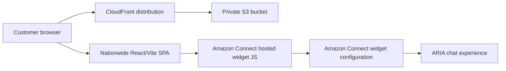

# Nationwide Chat Widget Playbook

| Field | Value |
|---|---|
| **Document ID** | PLY-NCW-001 |
| **Version** | 1.0 |
| **Owner** | Platform Engineering |
| **Date** | 2026-05-25 |
| **Status** | Active |
| **Classification** | Internal |

---

## 1. Purpose and Scope

This playbook defines the controlled deployment and operational release approach for the **Nationwide chat widget** in the `awsagentcore` repository. The component lives in `nationwide_chat_widget/` and is a **React + Vite single-page application** that renders a Nationwide-branded landing page and loads the **Amazon Connect hosted chat widget** from Amazon Connect's CDN.

In production, the widget is a **customer-facing web component** delivered through **CloudFront** with a **private S3 origin**. The React shell presents Nationwide branding while the hosted Connect widget provides the live chat surface customers use to reach **ARIA**.

### In scope

- `nationwide_chat_widget/` React/Vite frontend
- Hosted Amazon Connect chat widget bootstrap in `nationwide_chat_widget/index.html`
- Nationwide-specific branding, transcript labels, and assets
- `scripts/deploy_nationwide_chat_widget.sh` deployment to S3 + CloudFront
- Static asset delivery, cache control, invalidation, and approved-origin checks

### Out of scope

- Amazon Connect instance creation or chat channel enablement
- Contact-flow authoring inside Amazon Connect
- Lambda/API implementation behind ARIA
- DNS, ACM custom certificates, or WAF configuration not present in the script
- Changes to the upstream Amazon Connect hosted widget service

---

## 2. Component Overview

### 2.1 Architecture summary

The Nationwide widget follows the same hosted-widget pattern as Meridian with Nationwide-specific presentation:

1. `src/main.jsx` mounts the React app.
2. `src/App.jsx` renders a Nationwide-style page with logo header, product navigation, award badges, product icons, and promo panels.
3. `index.html` loads `https://conversationalbot.my.connect.aws/connectwidget/static/amazon-connect-chat-interface-client.js` and configures `amazon_connect(...)`.
4. `src/components/ConnectChatWidget.jsx` uses a `MutationObserver` to relabel transcript participants from `BOT` to `ARIA` and from `SYSTEM` to `Nationwide`.
5. `scripts/deploy_nationwide_chat_widget.sh` builds the app, uploads `dist/` to S3, creates or reuses CloudFront resources, and invalidates cache.

### 2.2 Delivery topology



### 2.3 Differences from the Meridian widget found in source

| Area | Meridian (`connect-chat-widget/`) | Nationwide (`nationwide_chat_widget/`) |
|---|---|---|
| Vite port | `4000` | `4001` |
| App shell | Simple Meridian landing page with feature cards | Two-tier Nationwide header, product nav, awards, product grid, promo cards |
| Branding | Meridian colours `#123456` / `#1a4a7a` | Nationwide colours `#0D2A66` / `#1A4A94` with red accent `#E63012` |
| Public assets | `favicon.svg` | `favicon.svg`, `nationwide-logo.png` |
| Transcript system label | `Meridian Bank` | `Nationwide` |
| Deployment naming | `meridian-connect-widget-*` | `nationwide-connect-widget-*` |
| Deploy summary formatting | Standard text summary | Summary visually highlights widget URL in a boxed banner |

### 2.4 Source-based configuration currently present

| Area | Source | Current implementation |
|---|---|---|
| App shell | `nationwide_chat_widget/src/App.jsx` | Nationwide landing page with logo image, product navigation, awards, icons, and promo cards |
| Local dev port | `nationwide_chat_widget/vite.config.js` | `4001` for dev server and preview |
| Public assets | `nationwide_chat_widget/public/` | `favicon.svg`, `nationwide-logo.png` |
| Widget script URL | `nationwide_chat_widget/index.html` | `https://conversationalbot.my.connect.aws/connectwidget/static/amazon-connect-chat-interface-client.js` |
| Widget bootstrap API | `nationwide_chat_widget/index.html` | `amazon_connect('styles'|'snippetId'|'supportedMessagingContentTypes'|'customDisplayNames'|'contactAttributes', ...)` |
| Participant relabeling | `nationwide_chat_widget/src/components/ConnectChatWidget.jsx` | `BOT -> ARIA`, `SYSTEM -> Nationwide` |

### 2.5 Important limitation from source review

As with Meridian, the current repository **does not expose** the following as discrete build-time variables or local config files:

- Amazon Connect instance URL
- Contact flow ARN / ID
- AWS region for chat initiation
- API Gateway endpoint
- Explicit `StartChatContact` client code

The current code delegates connection behaviour to the **hosted Amazon Connect snippet ID** embedded in `nationwide_chat_widget/index.html`.

---

## 3. Prerequisites

| Requirement | Detail |
|---|---|
| Node.js | **Node.js 20+ operationally recommended** for build/deploy work; `package.json` does not declare an `engines` field |
| npm | Required for `npm install` and `npm run build` |
| AWS CLI v2 | Required by `scripts/deploy_nationwide_chat_widget.sh` |
| AWS credentials | Must allow S3, CloudFront, and STS operations used by the script |
| Amazon Connect widget configuration | A valid hosted widget snippet configured in Amazon Connect |
| Approved origins | Must include `http://localhost:4001` for dev and the final CloudFront URL for production |
| S3 bucket name availability | Default name is `nationwide-connect-widget-<env>` unless `--bucket-name` is supplied |
| CloudFront permissions | Required for OAC, response headers policy, distribution create/update, and invalidation |

---

## 4. Deployment Strategy

### 4.1 Deployment phases implemented by `deploy_nationwide_chat_widget.sh`

| Phase | Implementation from script | Outcome |
|---|---|---|
| 1. Install + build | `npm install --silent` then `npm run build` | Produces `nationwide_chat_widget/dist/` |
| 2. Private S3 bucket | `aws s3api create-bucket`, block public access, AES-256 encryption, versioning suspended, delete bucket CORS | Private origin bucket prepared |
| 3. CloudFront OAC | `aws cloudfront create-origin-access-control` | CloudFront gets signed S3 access |
| 4. Initial bucket policy | `aws s3api put-bucket-policy` with wildcard distribution ARN | Allows CloudFront read access during distribution creation |
| 5. Response headers policy | `aws cloudfront create-response-headers-policy` | Applies HSTS, `SAMEORIGIN`, `nosniff`, referrer policy, XSS protection |
| 6. Distribution create/reuse | `aws cloudfront create-distribution` or stored ID reuse | HTTPS CDN endpoint with SPA fallback |
| 7. Tighten bucket policy | `aws s3api put-bucket-policy` with exact distribution ARN | Restricts S3 reads to the created distribution |
| 8. Upload build output | `aws s3 sync` and `aws s3 cp` with differentiated cache headers | `index.html`, hashed assets, logo asset, and other files published |
| 9. Cache invalidation | `aws cloudfront create-invalidation --paths "/*"` | Forces refresh of edge cache |

### 4.2 Security and caching behaviour from the script

- **S3 is private**; browser traffic goes through CloudFront only.
- **Origin Access Control (OAC)** is used instead of a public bucket.
- **HTTPS-only** viewer policy with minimum TLS `TLSv1.2_2021`.
- **No CSP header** is added by the script because the Connect widget needs external CDN access.
- Cache policy is split as follows:
  - `/index.html` -> no-cache
  - `/assets/*` -> 1 year immutable
  - everything else -> 1 day
- `403` and `404` responses are rewritten to `/index.html` for SPA routing.

### 4.3 Release sequencing

Promote in order:

1. Local development (`vite` on port `4001`)
2. Non-production deployment (`--env staging` or equivalent)
3. Production deployment (`--env prod` default)

No production release should be declared complete until the CloudFront URL is live and the Amazon Connect approved-origin entry has been added.

---

## 5. Environment Matrix

### 5.1 Runtime environments

| Environment | Command / deployment mode | Port / endpoint | Notes |
|---|---|---|---|
| Local development | `cd nationwide_chat_widget && npm run dev` | `http://localhost:4001` | Port is set in `vite.config.js`; add localhost origin in Amazon Connect |
| Staging | `bash scripts/deploy_nationwide_chat_widget.sh --env staging` | `https://<staging-cloudfront-domain>` | Creates or reuses staging-tagged bucket/state file names |
| Production | `bash scripts/deploy_nationwide_chat_widget.sh` | `https://<production-cloudfront-domain>` | Default `ENV=prod`, default region `eu-west-2` |

### 5.2 Configuration source of truth

The current widget **does not read any `VITE_*` environment variables**. Configuration is hardcoded in:

- `nationwide_chat_widget/index.html` for snippet/style/contact attributes
- `nationwide_chat_widget/src/components/ConnectChatWidget.jsx` for participant relabeling
- `nationwide_chat_widget/vite.config.js` for local dev/preview port

### 5.3 Placeholder matrix for values not stored in source

| Placeholder | Present in source? | Notes |
|---|---|---|
| `VITE_CONNECT_INSTANCE_URL=<YOUR_CONNECT_INSTANCE_URL>` | No | Not consumed by current code |
| `VITE_CONTACT_FLOW_ID=<YOUR_CONTACT_FLOW_ID>` | No | Not consumed by current code |
| `VITE_AWS_REGION=<YOUR_AWS_REGION>` | No | Deploy script defaults infrastructure to `eu-west-2`, but widget code does not read this as a Vite env var |
| `VITE_API_GATEWAY_URL=<YOUR_API_GATEWAY_URL>` | No | No API Gateway call exists in current widget source |

---

## 6. Change Management

### 6.1 Changes that require rebuild + redeploy

- Any edit to `nationwide_chat_widget/index.html`
- Any change to branding, copy, layout, or assets in `src/App.jsx`, `src/App.css`, `src/index.css`, or `public/nationwide-logo.png`
- Any change to transcript relabeling in `src/components/ConnectChatWidget.jsx`
- Any change to `vite.config.js`

### 6.2 Changes requiring cross-team coordination

- Amazon Connect hosted widget snippet replacement
- Approved-origin updates in Amazon Connect
- Any contact-flow or routing change that affects ARIA handoff
- Any security posture change to CloudFront or S3 policies

### 6.3 Deployment governance

- Treat production deploys as controlled changes.
- Coordinate Amazon Connect-side updates with the Contact Centre / Connect platform team.
- If the snippet is changed, validate that the new widget still maps transcript labels correctly to `ARIA` and `Nationwide`.

---

## 7. Risk Register

| ID | Risk | Probability | Impact | Mitigation | Owner |
|---|---|---:|---:|---|---|
| NCW-01 | Hosted widget snippet misconfigured or points to wrong Connect configuration | Medium | High | Validate `snippetId` in `index.html` and smoke-test chat after deploy | Platform Engineering |
| NCW-02 | Approved origins not updated in Amazon Connect | High | High | Add CloudFront URL and localhost origin before declaring success | Contact Centre Ops |
| NCW-03 | CloudFront OAC or bucket policy misconfigured | Medium | High | Verify asset fetches return `200`; inspect S3 bucket policy and CloudFront distribution ID | Platform Engineering |
| NCW-04 | S3 bucket name already taken | Medium | Medium | Use `--bucket-name` override when default name is unavailable | Platform Engineering |
| NCW-05 | CloudFront propagation delay | High | Medium | Communicate 5-15 minute deployment window and retest after edge propagation | Platform Engineering |
| NCW-06 | CSP or browser security policy blocks the hosted widget on the embedding page | Medium | High | Check browser console; confirm no restrictive CSP is added by the hosting site | Frontend Engineering |
| NCW-07 | Contact Centre routing behind the hosted snippet fails | Medium | High | Validate Connect-side routing before release; smoke-test ARIA interaction | Connect Platform |
| NCW-08 | Customer-facing page renders incorrectly because brand assets or CSS are missing | Medium | High | Verify `nationwide-logo.png`, CSS, and product grid load from CloudFront | Frontend Engineering |

---

## 8. Rollback Strategy

### 8.1 Standard rollback

1. Check out the prior known-good git tag or commit.
2. Rebuild the widget with `npm run build`.
3. Re-run `bash scripts/deploy_nationwide_chat_widget.sh`.
4. Confirm CloudFront invalidation completed.
5. Re-verify the chat widget and approved-origin entry.

### 8.2 Technical rollback characteristics

- The deployment script is **idempotent** and reuses existing infrastructure where possible.
- State is persisted in `nationwide_chat_widget/.deploy-state-<env>.env`.
- Rollback mainly consists of replacing the S3 objects and invalidating CloudFront.
- Script comments indicate **5-15 minutes** for distribution deployment and about **30 seconds** for invalidation visibility, although global edge propagation can take longer.

---

## 9. Communication Plan

| Audience | Trigger | Timing | Message content |
|---|---|---|---|
| Contact Centre Ops | Production deploy or snippet/origin change | At least 24 hours before production change | Planned deployment window, CloudFront URL, validation plan, rollback contact |
| Customer Success / Service teams | Any visible UI or wording change | Before release | What changed in the Nationwide page shell and any customer-visible transcript labels |
| Platform Engineering | Every deployment | Start and completion | Environment, script options used, distribution URL, validation outcome |

---

## 10. Success Criteria

A Nationwide release is successful when all of the following are true:

1. The CloudFront URL returns `200` for `/`.
2. `index.html`, hashed assets, logo asset, and public files load successfully from CloudFront.
3. The Nationwide landing page renders with expected branding and logo.
4. The floating Amazon Connect chat launcher appears.
5. Starting a chat opens the hosted Connect session successfully.
6. Transcript/system labels show `ARIA` and `Nationwide` as implemented in source.
7. If ARIA routing is managed behind the hosted snippet, the service team confirms a valid first response path after chat start.

---

## 11. Post-Deployment Validation

### 11.1 Required checks

- `curl -I https://<cloudfront-domain>` returns `200 OK`
- Browser loads the Nationwide page without missing JS/CSS/image assets
- `nationwide-logo.png` renders in the header
- Chat launcher is visible in the bottom overlay position
- Customer can open the chat panel
- Transcript labels are renamed as expected (`ARIA`, `Nationwide`)
- Amazon Connect approved-origin entry contains the deployed CloudFront URL

### 11.2 Useful verification commands

```bash
curl -I https://<cloudfront-domain>
aws cloudfront get-distribution --id <distribution-id> --query 'Distribution.Status' --output text
aws cloudfront create-invalidation --distribution-id <distribution-id> --paths "/*"
```

---

## 12. Contacts and Escalation

| Level | Team / role | When to engage |
|---|---|---|
| L1 | Platform Engineering | Build failure, broken deployment script, S3/CloudFront issue |
| L2 | Frontend Engineering | Nationwide page rendering defect, asset/CSS regression |
| L2 | Contact Centre / Connect Platform | Approved-origin issue, hosted snippet issue, routing or transcript issue inside Connect |
| L3 | Product / Service owner | Customer-impacting release decision, rollback approval, production communication |

---

## 13. Approvals

| Approval | Required from |
|---|---|
| Technical implementation | Platform Engineering lead |
| Contact routing / widget configuration | Amazon Connect platform owner |
| Production release | Service owner / product owner |

---

## Source References

- `nationwide_chat_widget/package.json`
- `nationwide_chat_widget/vite.config.js`
- `nationwide_chat_widget/index.html`
- `nationwide_chat_widget/src/App.jsx`
- `nationwide_chat_widget/src/components/ConnectChatWidget.jsx`
- `nationwide_chat_widget/src/App.css`
- `nationwide_chat_widget/src/index.css`
- `nationwide_chat_widget/public/favicon.svg`
- `nationwide_chat_widget/public/nationwide-logo.png`
- `scripts/deploy_nationwide_chat_widget.sh`
