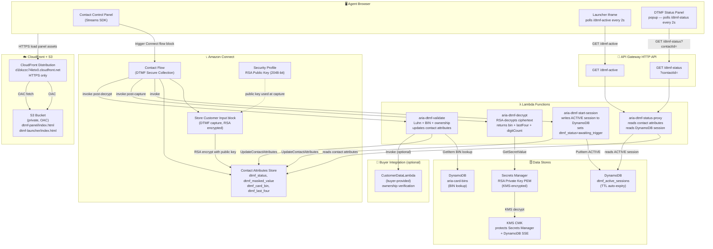
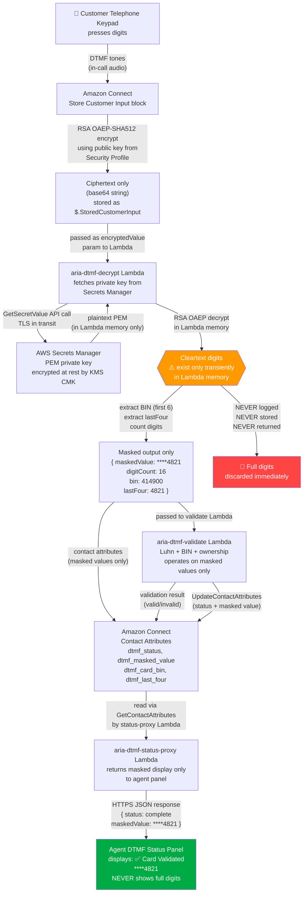
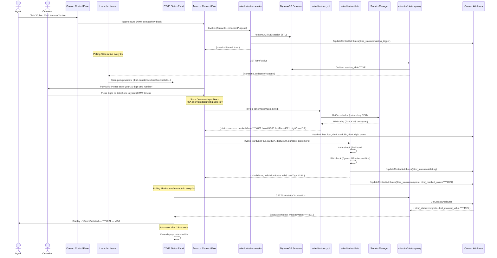
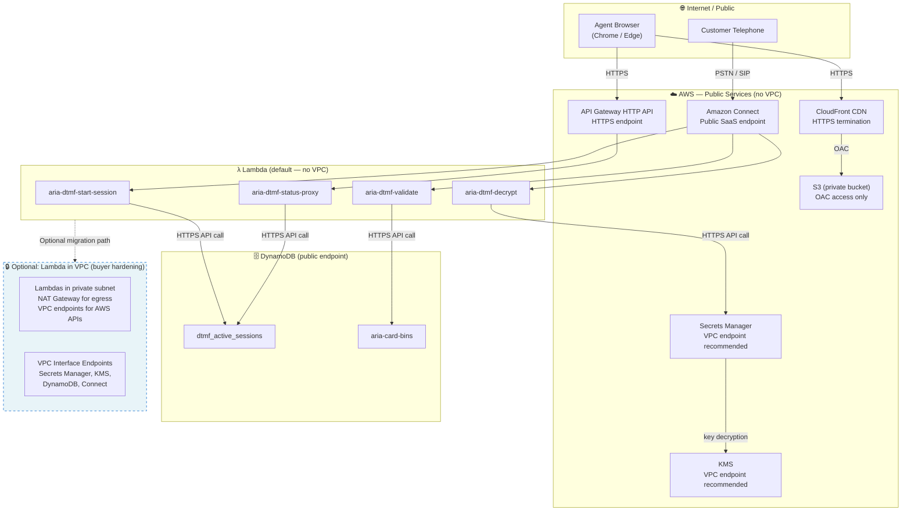

# Architecture: Secure DTMF Capture for Amazon Connect

> **Product:** Secure DTMF Capture for Amazon Connect  
> **Version:** 1.0  
> **Last Updated:** 2025

---

## 1. Solution Overview

**Secure DTMF Capture** adds encrypted telephone-keypad digit collection to any Amazon Connect contact centre. When an agent needs sensitive information from a customer — card number, SSN, account number, sort code, CVV, or PIN — the agent triggers a secure capture flow. The customer stays on the call and uses their telephone keypad. The digits are RSA-encrypted the instant they are captured by Amazon Connect, before any software reads them. They are decrypted privately in Lambda, validated, and only a masked result (e.g. `****4567`) is ever shown to the agent.

### Use Cases

| Use Case | Collection Purpose |
|---|---|
| Capture full payment card number for a transaction | `full_card_number` |
| Verify last four digits of card on file | `card_last_four` |
| Collect Social Security Number for identity verification | `ssn` |
| Collect UK bank account number | `account_number` |
| Collect UK sort code | `sort_code` |
| Collect card CVV for card-not-present transactions | `cvv` |
| Collect customer PIN for phone authentication | `pin` |
| Any other sensitive numeric input | `generic` |

### Key Benefits

- **Zero agent exposure** — agents never see, hear, or receive sensitive digits
- **RSA encryption at source** — digits are encrypted by Amazon Connect before any Lambda reads them
- **Real-time agent feedback** — a popup panel shows validation status without revealing digits
- **Flexible validation** — Luhn check, BIN lookup, and optional buyer-supplied ownership Lambda
- **PCI DSS alignment** — sensitive digits are never stored or logged in cleartext
- **Fully serverless** — no infrastructure to maintain; all components auto-scale
- **Configurable TTL** — DynamoDB sessions auto-expire; no manual cleanup required

---

## 2. Architecture Diagram



---

## 3. Component Deep Dive

### 3.1 `aria-dtmf-start-session` Lambda

**Role:** Initialises a new secure capture session before the DTMF prompt is played.

**Inputs:** Amazon Connect Lambda event containing `ContactId` and `collectionPurpose` from contact attributes.

**Actions:**
1. Writes a record to `dtmf_active_sessions` DynamoDB table with `session_id = "ACTIVE"`, the contact ID, purpose, and a TTL timestamp.
2. Calls `connect:UpdateContactAttributes` to set `dtmf_status = "awaiting_trigger"` on the contact.

**Outputs:** Returns `{ "sessionStarted": "true" }` to the Connect flow.

**Failure modes:** If DynamoDB is unavailable, the flow should branch to an error handler and play an apology prompt. The DTMF capture itself does not depend on this Lambda completing successfully — session state is advisory for the panel.

---

### 3.2 `aria-dtmf-decrypt` Lambda

**Role:** RSA-decrypts the ciphertext produced by the Connect "Store customer input" block.

**Inputs:** `encryptedValue` (base64 ciphertext from `$.StoredCustomerInput`), `keyId` (the Connect Security Key ID).

**Internals:**
- Fetches the RSA private key PEM from Secrets Manager (cached in Lambda memory for the function lifetime).
- Uses the `aws-encryption-sdk` with `RawMasterKey` and `WrappingAlgorithm.RSA_OAEP_SHA512_MGF1` to decrypt.
- Extracts the cleartext digits.
- **Never logs or returns full digits.**

**Outputs:**
```json
{
  "status": "success",
  "maskedValue": "****4821",
  "digitCount": 16,
  "purpose": "full_card_number",
  "errorMessage": ""
}
```
Additionally sets contact attributes `dtmf_last_four`, `dtmf_card_bin`, `dtmf_digit_count`.

**Failure modes:** Returns `"status": "failed"` with `errorMessage`. The Connect flow branches on this to play a retry or failure prompt.

---

### 3.3 `aria-dtmf-validate` Lambda

**Role:** Validates the captured digits according to the `collectionPurpose`, then writes the result to contact attributes.

**Inputs:** `cardLastFour`, `cardBin`, `digitCount`, `purpose`, `customerId`, `authStatus` from contact attributes and Lambda parameters.

**Validation chain (short-circuits on first failure):**

| Step | Applies to | Check |
|---|---|---|
| Luhn algorithm | `full_card_number` | ISO/IEC 7812 structural check |
| BIN lookup | `full_card_number`, `card_last_four` | DynamoDB `aria-card-bins` |
| Format check | `ssn`, `account_number`, `sort_code`, `cvv`, `pin` | Digit count and pattern |
| Ownership check | Any, if `CustomerDataLambdaArn` configured | Buyer Lambda invocation |

**Outputs:** Sets `dtmf_status` to `complete` or `failed`, sets `dtmf_masked_value`, `dtmf_failure_reason`. Returns a structured JSON result to the Connect flow.

**Failure modes:** On any service error (DynamoDB unavailable, customer Lambda timeout), returns `validationStatus = "validation_service_error"` — fail-open, never blocks the customer due to infrastructure issues.

---

### 3.4 `aria-dtmf-status-proxy` Lambda

**Role:** Serves the two polling API endpoints consumed by the agent's browser.

**Endpoints:**

| Endpoint | Query Param | Data Source | Purpose |
|---|---|---|---|
| `GET /dtmf-status` | `contactId` | `connect:GetContactAttributes` | Returns current `dtmf_status`, `dtmf_masked_value`, `dtmf_failure_reason` |
| `GET /dtmf-active` | none | DynamoDB `dtmf_active_sessions` | Returns ACTIVE session `contactId` and `collectionPurpose` |

**Security:** This Lambda must only be accessible via API Gateway with CORS locked to the CloudFront domain. It returns masked values only — never raw digits.

---

### 3.5 DynamoDB — `dtmf_active_sessions`

**Role:** Holds the single `ACTIVE` session record. Only one secure capture session can be active per Connect instance at a time (by design — one agent triggers at a time).

**Schema:** See [Configuration Reference — DynamoDB Schemas](configuration-reference.md#dynamodb-schemas).

**TTL:** Configurable (default 2 hours). Stale sessions are automatically deleted by DynamoDB TTL, preventing the agent panel from showing a ghost session.

---

### 3.6 DynamoDB — `aria-card-bins`

**Role:** BIN prefix → card type mapping. Used by the validate Lambda for BIN-level card identification.

**Populated by:** Buyer loads records at deploy time. Optional — if empty, BIN check is skipped.

**Note:** BIN data is not PCI-sensitive — it is publicly available from card networks and commercial BIN databases.

---

### 3.7 API Gateway HTTP API

**Role:** Exposes `/dtmf-status` and `/dtmf-active` as HTTPS endpoints for the agent's browser to poll.

**CORS:** Configured to allow `https://<CloudFrontDomain>` only. Buyers should restrict this further using a WAF rule or by locking the allowed origin to their agent portal domain.

---

### 3.8 S3 + CloudFront

**Role:** Hosts two single-page HTML applications:
- `dtmf-panel/index.html` — the agent status popup (polls `/dtmf-status`)
- `dtmf-launcher/index.html` — the CCP iframe wrapper (polls `/dtmf-active`, opens panel on new session)

**Security:** S3 bucket is entirely private. CloudFront uses Origin Access Control (OAC) — no public S3 access. HTTPS only; HTTP redirects to HTTPS.

---

### 3.9 KMS CMK + Secrets Manager

**Role:** Protect the RSA private key at rest.

- **Secrets Manager** stores the PEM-encoded private key as a secure string.
- **KMS CMK** encrypts the secret. The `aria-dtmf-decrypt` role is the only IAM principal granted `kms:Decrypt`.
- **Key rotation:** Buyers rotate the RSA key pair using `generate-rsa-keypair.sh --rotate`. The old Connect Security Key remains valid for in-flight calls during the transition window.

---

### 3.10 Amazon Connect Security Profile — Security Keys

**Role:** Holds the RSA public key used by the "Store customer input" block to encrypt DTMF digits.

**Key ID:** Amazon Connect returns a UUID key ID when a public key is added. This ID must be configured as `CONNECT_KEY_ID` in the decrypt Lambda's environment variables.

**Important:** Deleting a Security Key from Connect immediately breaks decryption for any call currently mid-capture using that key. Always add the new key before removing the old one during rotation.

---

## 4. Security Architecture

The following diagram traces exactly how sensitive digits flow through the system, and shows what is encrypted, masked, or blocked at each boundary.



### Security Invariants

The following invariants are enforced by the architecture:

1. **Full digits exist only in Lambda memory** — they are never written to disk, logs, DynamoDB, contact attributes, or HTTP responses.
2. **The private key never leaves Secrets Manager in a form that persists** — it is loaded into Lambda memory per-invocation and discarded at function end.
3. **Only the decrypt Lambda's IAM role has `kms:Decrypt`** — no other component can access the raw private key.
4. **The validate Lambda never receives full digits** — it operates on `bin` and `lastFour` only.
5. **The status panel never displays full digits** — it shows only the masked value set by the validate Lambda.

---

## 5. Sequence Diagram



---

## 6. Network Topology



### VPC Deployment Guidance

By default, all four Lambda functions run outside a VPC and communicate with AWS services via public HTTPS endpoints. This is the simplest configuration and is acceptable for most deployments.

**If your organisation requires Lambdas in a VPC:**

1. Place Lambdas in a **private subnet** with a NAT Gateway for outbound internet access.
2. Create **VPC Interface Endpoints** for: `secretsmanager`, `kms`, `dynamodb`, `execute-api`, `connect`.
3. Update Lambda VPC configuration via the CloudFormation template parameters `VpcId`, `SubnetIds`, and `SecurityGroupIds`.
4. Ensure security groups permit outbound HTTPS (port 443) to the VPC endpoints.

---

## 7. Data Flow and Privacy

The following table documents exactly what data is present at each processing stage, whether it is encrypted, and whether it appears in logs.

| Stage | Data Present | Encrypted? | Logged? | Notes |
|---|---|---|---|---|
| Customer keypad | Full DTMF digits (audio tones) | No (in-call audio) | No | Digits are tones only; never in call recording if DTMF masking enabled |
| Connect "Store customer input" | Full digits (transient in Connect) | Yes — RSA OAEP-SHA512 with public key | No | Connect encrypts before any Lambda sees them |
| Decrypt Lambda input | Ciphertext (base64) | Yes — TLS in transit | No | `encryptedValue` parameter only |
| Decrypt Lambda memory | Cleartext digits | No (in-memory only) | **Never** | Discarded immediately after extracting bin+lastFour |
| Decrypt Lambda output | `bin`, `lastFour`, `digitCount`, `maskedValue` | TLS in transit | No | Full digits are NOT in the output |
| Contact Attributes | `dtmf_status`, `dtmf_masked_value`, `dtmf_card_bin`, `dtmf_last_four`, `dtmf_digit_count` | Connect platform encryption | Connect audit only | No full card number ever written here |
| DynamoDB Sessions | `contactId`, `collectionPurpose`, `status`, TTL | KMS CMK (SSE) | No | Session metadata only; no card data |
| DynamoDB BINs | BIN prefix → card type mapping | KMS CMK (SSE) | No | BINs are publicly available, not PCI-sensitive |
| Secrets Manager | RSA private key PEM | KMS CMK | CloudTrail (access events only) | Key value never logged |
| Validate Lambda | `cardBin`, `lastFour`, `digitCount` | TLS in transit | No | Never receives full card number |
| Status proxy Lambda output | `dtmf_status`, `dtmf_masked_value` | TLS (HTTPS) | No | Masked display string only |
| Agent panel (browser) | Masked display (`****4567`) | HTTPS | No | Full digits never reach browser |

---

## 8. IAM Permission Matrix

| Lambda | Required Permission | Resource Scope | Reason |
|---|---|---|---|
| `aria-dtmf-decrypt` | `secretsmanager:GetSecretValue` | Specific secret ARN | Read RSA private key |
| `aria-dtmf-decrypt` | `kms:Decrypt` | Specific CMK ARN | Decrypt the secret |
| `aria-dtmf-decrypt` | `logs:CreateLogGroup`, `logs:CreateLogStream`, `logs:PutLogEvents` | Log group ARN | CloudWatch Logs |
| `aria-dtmf-decrypt` | `dynamodb:GetItem`, `dynamodb:Query` | `aria-card-bins` ARN | BIN pre-check (optional) |
| `aria-dtmf-validate` | `dynamodb:GetItem`, `dynamodb:Query` | `aria-card-bins` ARN | BIN lookup |
| `aria-dtmf-validate` | `connect:UpdateContactAttributes` | Connect instance ARN | Push real-time status to CCP |
| `aria-dtmf-validate` | `lambda:InvokeFunction` | CustomerDataLambdaArn | Ownership check (optional) |
| `aria-dtmf-validate` | `logs:CreateLogGroup`, `logs:CreateLogStream`, `logs:PutLogEvents` | Log group ARN | CloudWatch Logs |
| `aria-dtmf-start-session` | `dynamodb:PutItem`, `dynamodb:UpdateItem` | `dtmf_active_sessions` ARN | Write ACTIVE session |
| `aria-dtmf-start-session` | `connect:UpdateContactAttributes` | Connect instance ARN | Set initial dtmf_status |
| `aria-dtmf-start-session` | `logs:*` | Log group ARN | CloudWatch Logs |
| `aria-dtmf-status-proxy` | `dynamodb:GetItem` | `dtmf_active_sessions` ARN | Read ACTIVE session |
| `aria-dtmf-status-proxy` | `connect:GetContactAttributes` | Connect instance ARN | Read status for panel |
| `aria-dtmf-status-proxy` | `logs:*` | Log group ARN | CloudWatch Logs |

All roles follow the **principle of least privilege**. No role has wildcard resource access (`*`) on sensitive services.

---

## 9. Disaster Recovery and Resilience

### Lambda Failure Modes

| Component | Failure Mode | Impact | Recovery |
|---|---|---|---|
| `aria-dtmf-start-session` fails | DynamoDB unavailable | Launcher panel does not auto-open (agent manually opens via URL) | DynamoDB multi-AZ by default; recovers automatically |
| `aria-dtmf-decrypt` fails | Secrets Manager unavailable or key invalid | Connect flow branches to failure handler; customer hears apology | Secret cached in Lambda memory across warm invocations |
| `aria-dtmf-validate` fails | BIN table empty or customer Lambda timeout | Returns `validation_service_error`; call continues | Fail-open by design; agent can proceed with alternative verification |
| `aria-dtmf-status-proxy` fails | Lambda cold start or Connect API throttle | Panel shows last known status until next poll succeeds | 2-second poll interval; transient failures are invisible to agent |

### Session TTL and Stale State

DynamoDB TTL is set to `SessionTTLHours` (default 2 hours) from session creation time. If a call ends abnormally (e.g. call drops mid-capture), the session record expires automatically without any manual intervention.

For immediate cleanup (e.g. after testing), run:

```bash
aws dynamodb delete-item \
  --table-name dtmf_active_sessions \
  --key '{"session_id":{"S":"ACTIVE"}}' \
  --region eu-west-2
```

### Multi-AZ Resilience

| Service | Resilience | Notes |
|---|---|---|
| Lambda | Multi-AZ by default | Auto-scaled, no single point of failure |
| DynamoDB | Multi-AZ by default | Global Tables available for multi-region deployments |
| Secrets Manager | Multi-AZ by default | Private key cached in Lambda warm instances |
| CloudFront | Global CDN | Agent panel assets served from edge locations |
| API Gateway | Multi-AZ by default | Regional deployment; enable multi-region with Route 53 if required |
| Amazon Connect | AWS-managed HA | Connect SLA includes multi-AZ infrastructure |

### Graceful Degradation

The solution is designed to **fail open** on service errors:

- If BIN validation fails (DynamoDB error) → skip BIN check, log warning, continue
- If ownership check fails (customer Lambda timeout) → return `validation_service_error`, do not block customer
- If status proxy fails (transient) → panel retries on next 2-second poll
- If DTMF session write fails → capture still proceeds; only panel auto-open is affected
